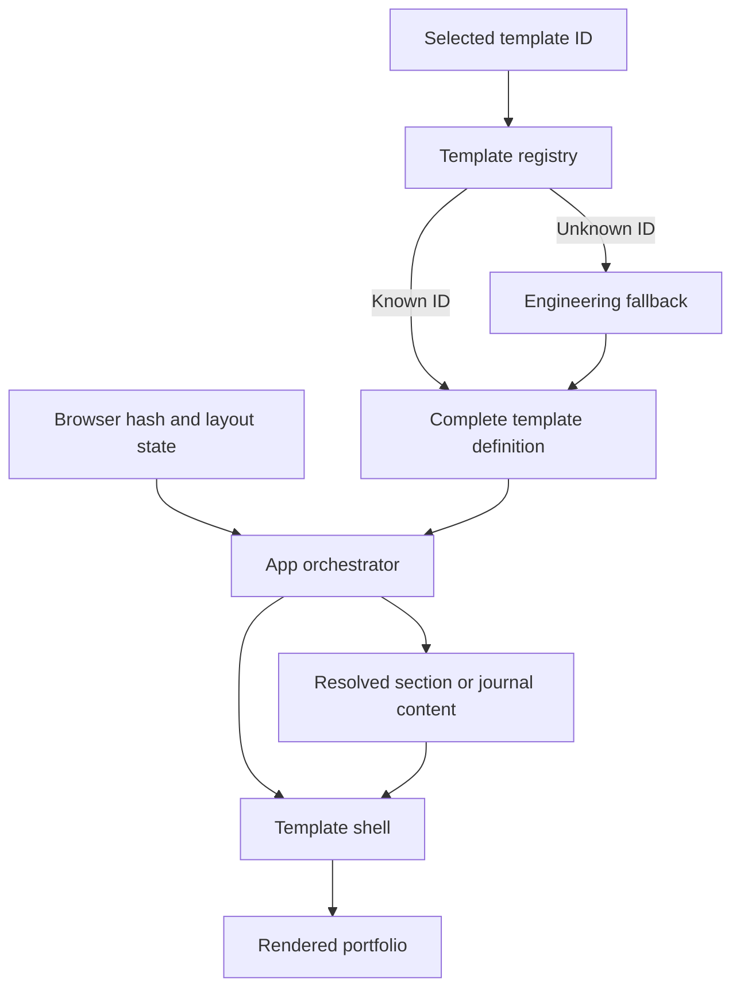
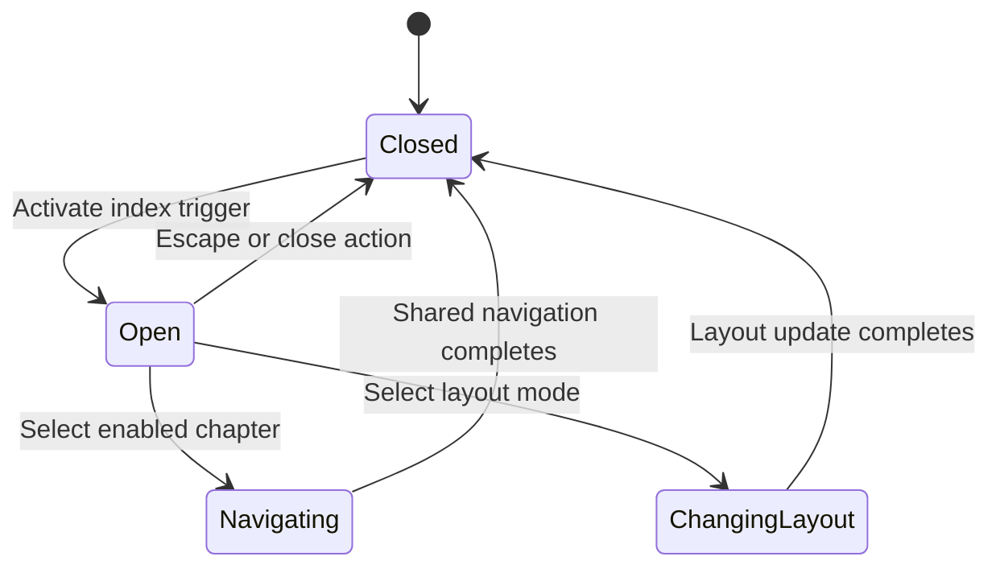
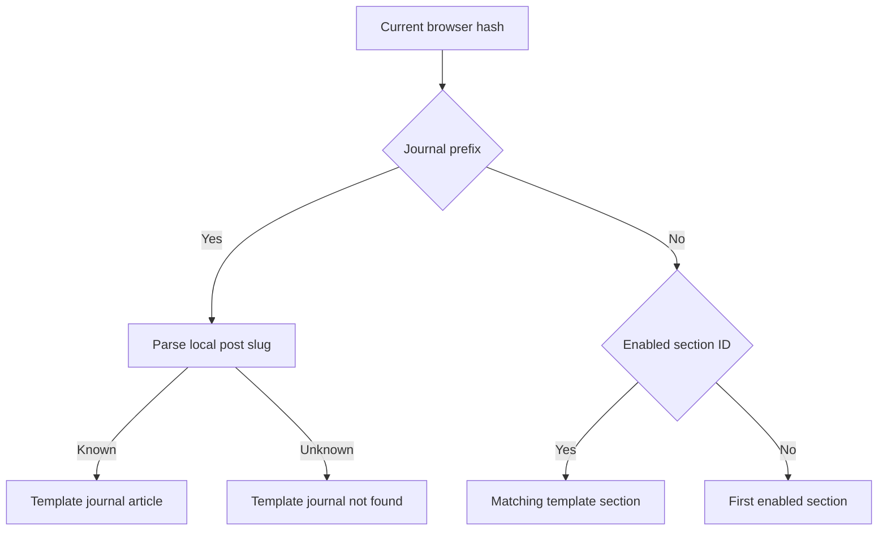
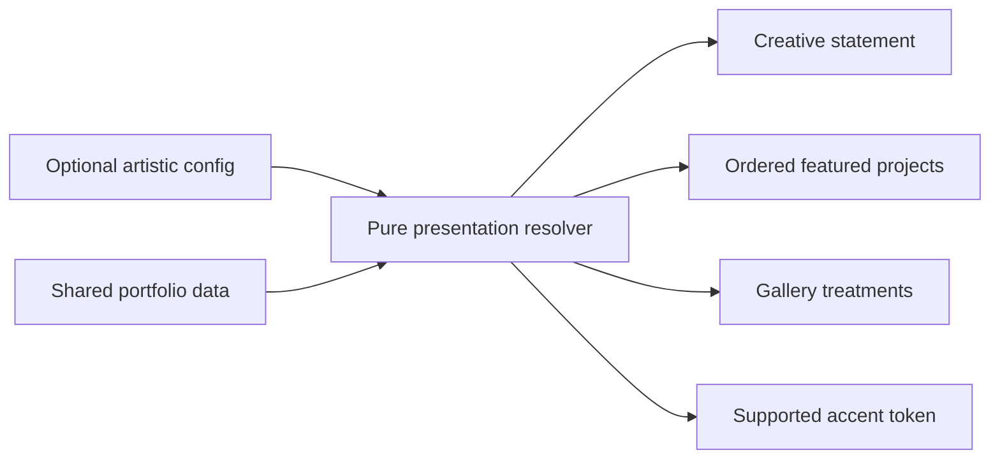

# Business Logic Model - ATR-U1 Template Shell and Configuration Foundation

## Purpose

ATR-U1 expands template selection from a section-component lookup into a complete presentation contract. `App` remains the owner of browser, layout, and route state. The selected template supplies a shell, a local journal view, chapter labels, and a complete section map. Optional artistic settings are resolved into complete presentation values before artistic components consume them.

## Approved Functional Decisions

| Decision | Resolved Behavior |
|---|---|
| Chapter selection focus | Keyboard selection closes the index and focuses the destination heading or main landmark. Pointer selection keeps natural browser focus behavior. |
| Featured project IDs | Unknown IDs are ignored, the first duplicate wins, configured order is preserved, and no valid configured IDs falls back to all projects. |
| Layout change from index | Apply the new layout, preserve the current section, close the index, and focus the main content context. |
| Invalid hashes | Invalid section hashes resolve to the first enabled section. Unknown local journal slugs render the template-specific not-found view. |
| Active artistic chapter | Reuse the shared active `SectionId` and map it through the selected template's chapter labels. |

## Workflow 1: Resolve and Compose a Template

### Text Alternative

The registry resolves the student-selected template ID and falls back to engineering if no template matches. App combines the complete template definition with browser and layout state, selects either section content or the template's journal view, and passes that content plus shared callbacks into the template shell.

### Steps

1. Read `selectedTemplateId` from the student-editable template configuration.
2. Resolve a complete `PortfolioTemplate` from the registry.
3. Build enabled navigation items and enabled section IDs from shared navigation data.
4. Resolve layout mode, active section, active routed section, and navigation callbacks through shared hooks.
5. Classify the current hash as a section route, local journal route, or fallback route.
6. Render the template's `JournalPostComponent` for a local journal route; otherwise render its section component map for the visible section IDs.
7. Pass shared shell state and rendered content to the template's `ShellComponent`.
8. The shell frames the content without parsing hashes or mutating layout storage directly.

## Workflow 2: Render Sections by Layout Mode

### Single-Page Mode

1. App renders every enabled `SectionId` in configured navigation order.
2. Each section component keeps its stable root ID.
3. `useActiveSection` derives the active `SectionId` from the shared ordered IDs.
4. The artistic header maps that ID to the artistic chapter label.
5. Navigation creates an anchor hash and scrolls to the matching section.

### Multi-Page Mode

1. App resolves one active page section from the direct hash or current state.
2. App renders only the matching template section component.
3. The shell remains present around the routed content.
4. The artistic header maps the routed `SectionId` to the artistic chapter label immediately.
5. Navigation creates a `#/section` hash and replaces the visible routed section.

### Invariant

The layout changes presentation quantity, not section identity. The same enabled IDs, component map, labels, and navigation callbacks are used in both modes.

## Workflow 3: Open, Dismiss, and Navigate from the Visual Index

### Text Alternative

The visual index begins closed. Activating its trigger opens the dialog and moves focus inside. Escape or the close action dismisses it and returns focus to the trigger. Selecting a chapter invokes shared navigation, closes the dialog, and applies the destination-focus policy. Selecting a layout mode invokes the shared layout callback, preserves the current section, closes the dialog, and focuses the main content context.

### Chapter Selection Steps

1. Open the Chakra Dialog from the artistic header trigger.
2. Dialog behavior moves focus inside, contains keyboard focus, and exposes Escape dismissal.
3. Render only enabled navigation destinations, using artistic labels over stable section IDs.
4. Mark the active destination programmatically and with a non-color-only visual state.
5. On selection, record whether activation was keyboard or pointer initiated.
6. Invoke the App-provided `onNavigate(sectionId)` callback.
7. Close the visual index.
8. For keyboard activation, focus the destination chapter heading when available; otherwise focus the artistic main landmark.
9. For pointer activation, allow natural browser focus behavior.

### Dismissal Steps

1. Escape, backdrop dismissal, or the explicit close command closes the index without navigation.
2. Dialog return-focus behavior restores focus to the index trigger.
3. Current layout and section remain unchanged.

## Workflow 4: Change Layout from the Visual Index

1. Capture the current shared `activeSection` before invoking the layout callback.
2. Invoke `onToggleLayoutMode`; the shared layout hook writes the next mode and creates the correct hash for the same section.
3. Close the visual index.
4. After the new content context is mounted, focus the main landmark or its current chapter heading.
5. Keep the current artistic chapter label derived from the same `SectionId`.
6. If the current ID is no longer enabled, use the first enabled section as the deterministic fallback.

## Workflow 5: Resolve Direct Hashes and Journal Routes

### Text Alternative

The hash parser checks local journal routes before section routes. A known local slug renders the selected template's article view, while an unknown slug renders its not-found state. A valid section hash renders that section according to the selected layout mode. Any invalid section ID resolves to the first enabled section rather than producing a generic error page.

### Route Rules

- `#/journal/{slug}` remains a local journal route even when the slug is unknown.
- Unknown local slugs must reach the template journal component so it can render not-found content and a return action.
- Valid `#/section` hashes select multi-page mode and the matching section.
- Valid `#section` hashes retain single-page anchor behavior.
- Invalid section IDs resolve to the first enabled navigation destination.
- Route resolution never uses an artistic-only section ID; artistic labels are presentation aliases for stable IDs.

## Workflow 6: Resolve Artistic Presentation Configuration

### Text Alternative

A pure resolver receives optional artistic settings and shared portfolio data. It always returns a non-empty creative statement, a deterministic ordered project list, a treatment for every gallery item, and a supported accent token. Artistic components consume only this resolved result.

### Creative Statement Resolution

1. Trim the optional configured statement.
2. Use it when non-empty.
3. Otherwise use the first available non-empty source in this order: About introduction, Hero introduction, profile summary.
4. If all sources are unexpectedly empty, use a stable short artistic default defined by the template.

### Featured Project Resolution

1. Build a project lookup by stable non-empty project ID.
2. Iterate requested IDs in configured order.
3. Ignore unknown IDs.
4. Keep only the first occurrence of a repeated ID.
5. Return the resolved list when at least one project remains.
6. When IDs are absent or no valid IDs remain, return all projects in shared-data order.

### Gallery Treatment Resolution

1. Match configured treatment entries by existing gallery item ID.
2. Ignore configuration keys that do not match a gallery item.
3. Accept only supported treatment tokens.
4. For absent or unsupported values, derive a deterministic treatment from the item's stable position.
5. Return a treatment for every gallery item without mutating the gallery data.

### Accent Resolution

1. Accept only a closed union of supported artistic accent tokens.
2. Use the configured token when supported.
3. Otherwise return the artistic default token.
4. Do not pass arbitrary configuration strings directly into style properties.

## Failure and Fallback Matrix

| Condition | Required Result |
|---|---|
| Unknown template ID at runtime | Resolve the engineering template. |
| Template definition omits a required capability | Fail TypeScript or registry contract tests before release. |
| Enabled section lacks a component or label | Fail contract tests; do not ship a partial registry. |
| Invalid section hash | Render the first enabled section through the current template. |
| Unknown local journal slug | Render the selected template's journal not-found state and return action. |
| No enabled sections | Use the existing `home` safety default and flag invalid navigation data in tests. |
| Missing creative statement | Derive it from shared text sources in fixed order. |
| Unknown featured project ID | Ignore it. |
| Repeated featured project ID | Keep the first occurrence only. |
| No valid featured project IDs | Return all projects in shared-data order. |
| Unknown gallery treatment | Use the deterministic treatment fallback. |
| Unknown accent token | Use the default artistic accent. |
| Layout storage unavailable | Continue with the shared default layout behavior. |

## Side Effects and Ownership

| Operation | Owner | Side Effect |
|---|---|---|
| Read/write layout preference | `usePortfolioLayout` | Local storage access with graceful fallback. |
| Create and update section hashes | `usePortfolioLayout` | Browser history update. |
| Synchronize local journal hash | App | Browser event subscription. |
| Track active single-page section | `useActiveSection` | Passive scroll listener. |
| Open/close visual index | `ArtisticShell` | Local React state and focus transition. |
| Resolve artistic metadata | Presentation resolver | None; pure transformation. |
| Select template | Template registry | None; deterministic lookup. |

## Traceability

| Workflow | Stories | Requirements |
|---|---|---|
| Template resolution and composition | US-01, US-12, US-13 | FR-01, FR-02, FR-04, FR-19, FR-26; NFR-10, NFR-15, NFR-16 |
| Visual index and chapter awareness | US-03, US-04 | FR-05, FR-06, FR-07, FR-20, FR-21; NFR-01, NFR-02 |
| Direct route handling | US-04, US-12 | FR-20, FR-21, FR-22, FR-23 |
| Artistic metadata resolution | US-01, US-02, US-05, US-06 | FR-24, FR-25; NFR-17 |

## Extension Rule Compliance

| Extension | Status | Rationale |
|---|---|---|
| Security Baseline | Disabled | Disabled during Requirements Analysis; no security extension constraints apply. |
| Property-Based Testing | Disabled | Disabled during Requirements Analysis; no property-based testing constraints apply. |
