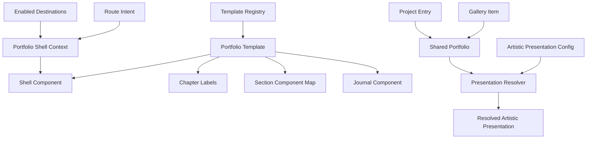

# Domain Entities - ATR-U1 Template Shell and Configuration Foundation

## Domain Boundary

ATR-U1 contains a static presentation domain. Entities describe template capabilities, shared shell state, stable navigation identity, and optional artistic presentation settings. The domain does not introduce persistence models, network resources, user accounts, or mutable portfolio records.

## Relationship Model



### Text Alternative

The template registry owns complete portfolio template definitions. Each template references one shell component, one chapter-label map, one section-component map, and one journal component. App builds a shell context from enabled navigation and route/layout state. Separately, the artistic presentation resolver combines optional artistic configuration with shared portfolio entities, including projects and gallery items, to produce a complete resolved presentation.

## Entity: PortfolioTemplate

```ts
type PortfolioTemplate = {
  id: PortfolioTemplateId
  label: string
  description: string
  ShellComponent: ComponentType<PortfolioShellProps>
  JournalPostComponent: ComponentType<JournalPostPageProps>
  chapterLabels: Record<SectionId, string>
  sectionComponents: Record<SectionId, ComponentType>
}
```

### Identity

- `id` is the stable registry key: `engineering` or `artistic`.

### Invariants

- Every field is required after construction.
- `chapterLabels` and `sectionComponents` cover every `SectionId`.
- Chapter labels are non-empty display strings.
- Section components preserve their mapped section's root DOM ID.
- One template ID appears at most once in the registry.

## Value Object: PortfolioTemplateId

```ts
type PortfolioTemplateId = 'engineering' | 'artistic'
```

- Used by student configuration and compile-time registry checks.
- Runtime lookup still returns engineering when input is outside this union.

## Entity: PortfolioShellContext

Represented by `PortfolioShellProps` at the component boundary.

```ts
type PortfolioShellProps = {
  activeSection: SectionId
  layoutMode: LayoutMode
  navigationItems: EnabledNavigationItem[]
  getNavigationHref: (sectionId: SectionId) => string
  onNavigate: (sectionId: SectionId) => void
  onToggleLayoutMode: () => void
  children: ReactNode
}
```

### Invariants

- `activeSection` is enabled, except for the existing `home` safety default when navigation data is invalid.
- `navigationItems` contains only entries whose `enabled` value is true.
- `children` already represents the section or journal content selected by App.
- Callbacks delegate to shared layout behavior and are not reimplemented by shells.
- A journal detail route sets `activeSection` to `journal` for shell presentation.

## Entity: NavigationDestination

This is the enabled form of the existing navigation item.

```ts
type EnabledNavigationItem = NavigationItem & { enabled: true }
```

### Identity and Invariants

- `id: SectionId` is both route identity and target section identity.
- `label` remains the shared engineering label.
- The artistic visual index displays `chapterLabels[id]` while preserving `id` for href and navigation behavior.
- Destination order follows shared navigation configuration.

## Value Object: SectionId

```ts
type SectionId =
  | 'home'
  | 'about'
  | 'education'
  | 'experience'
  | 'awards'
  | 'projects'
  | 'gallery'
  | 'journal'
  | 'skills'
  | 'contact'
```

- This union is stable across templates.
- Artistic chapter labels do not extend or replace it.
- Hash parsing, section rendering, active tracking, and metadata mapping all use it.

## Entity: ChapterDefinition

```ts
type ChapterDefinition = {
  sectionId: SectionId
  label: string
  number: string
  enabled: boolean
}
```

### Derivation

- `sectionId` and `enabled` come from shared navigation.
- `label` comes from the active template's chapter-label map.
- `number` is derived from enabled navigation order and is presentation-only.

### Invariants

- There is one chapter definition per stable `SectionId`.
- Only enabled definitions appear in the visual index.
- Numbering never determines routing.

## Entity: RouteIntent

```ts
type RouteIntent =
  | { kind: 'single-section'; sectionId: SectionId }
  | { kind: 'multi-section'; sectionId: SectionId }
  | { kind: 'journal-post'; slug: string }
  | { kind: 'section-fallback'; sectionId: SectionId }
```

### Classification Rules

- Journal-prefix matching happens before section fallback.
- Valid slash-prefixed section hashes produce `multi-section`.
- Valid anchor section hashes produce `single-section`.
- Invalid section hashes produce `section-fallback` with the first enabled ID.
- Route intent contains canonical IDs, never artistic labels.

## Entity: VisualIndexState

```ts
type VisualIndexState = {
  status: 'closed' | 'open'
  pendingFocus?:
    | { kind: 'chapter'; sectionId: SectionId }
    | { kind: 'main' }
  activationMode?: 'keyboard' | 'pointer'
}
```

### State Transitions

| From | Event | To | Focus Result |
|---|---|---|---|
| Closed | Open trigger | Open | Dialog moves focus inside. |
| Open | Escape/close/backdrop | Closed | Return to index trigger. |
| Open | Keyboard chapter selection | Closed | Destination heading, then main fallback. |
| Open | Pointer chapter selection | Closed | Natural pointer focus behavior. |
| Open | Layout toggle | Closed | Main content context after layout update. |

### Invariants

- Pending focus exists only while a selection or layout transition is being completed.
- Closing without navigation never creates destination focus.
- Focus movement must not target disabled or unmounted destinations.

## Entity: ProjectEntry

The existing shared entity gains stable identity.

```ts
type ProjectEntry = {
  id: string
  title: string
  description: string
  logoKey: string
  logoLabel: string
  logoAccent?: string
  technologies: string[]
  actions: ExternalLink[]
}
```

### Identity and Invariants

- `id` is non-empty, unique, stable, and independent of title text.
- The new ID does not change existing project content or action behavior.
- Artistic configuration references `id`; rendered labels continue using human-readable fields.

## Value Objects: GalleryTreatment and ArtisticAccent

```ts
type GalleryTreatment = 'portrait' | 'landscape' | 'feature'

type ArtisticAccent = 'vermillion' | 'cobalt' | 'jade' | 'gold'
```

- These are closed presentation token sets.
- Exact token names may align with implementation naming, but the implementation must retain a closed union and one documented default.
- Tokens map to scoped CSS variables; they are not arbitrary CSS values.

## Entity: ArtisticPresentationConfig

```ts
type ArtisticPresentationConfig = {
  creativeStatement?: string
  featuredProjectIds?: string[]
  galleryTreatments?: Partial<Record<string, GalleryTreatment>>
  accent?: ArtisticAccent
}
```

### Invariants

- Every field is optional.
- The entity stores presentation preference only; it does not duplicate projects, gallery items, or profile text.
- Project and gallery references use stable IDs.
- Invalid runtime references are tolerated by the resolver.
- Empty configured strings are treated as missing.

## Entity: ResolvedArtisticPresentation

```ts
type ResolvedArtisticPresentation = {
  creativeStatement: string
  featuredProjects: readonly ProjectEntry[]
  galleryTreatments: Readonly<Record<string, GalleryTreatment>>
  accent: ArtisticAccent
}
```

### Invariants

- `creativeStatement` is non-empty.
- `featuredProjects` contains only members of shared `portfolio.projects` and contains no duplicate IDs.
- Project ordering is configured order when at least one configured ID resolves; otherwise shared-data order.
- `galleryTreatments` has one valid treatment for every shared gallery item ID and no required entry for unknown IDs.
- `accent` is always supported.
- All returned collections are treated as immutable.

## Entity: JournalPostPageProps

```ts
type JournalPostPageProps = {
  slug: string
}
```

### Invariants

- The template journal component receives the parsed slug whether or not a post exists.
- Post lookup and not-found selection occur inside the journal presentation boundary.
- The page always offers a route back to the canonical `journal` destination.

## Aggregate and Ownership Table

| Aggregate or Value | Source of Truth | Mutability | Consumer |
|---|---|---|---|
| Template registry | `src/templates/index.ts` | Build-time static | App |
| Template definition | Template module | Build-time static | Registry and App |
| Shell context | App and shared hooks | Runtime derived | Active shell |
| Navigation destinations | Shared navigation data | Build-time static | App and shells |
| Route intent | Browser hash | Runtime derived | App and layout service |
| Artistic config | `src/data/artistic.ts` | Student-edited build-time static | Presentation resolver |
| Shared portfolio | Existing data modules | Build-time static | Both templates and resolver |
| Resolved artistic presentation | Pure resolver | Runtime/build evaluation derived | Artistic components |
| Visual index state | ArtisticShell | Local runtime state | Header and visual index |

## Validation Constraints

- Registry completeness is enforced by TypeScript plus registry tests.
- Project ID uniqueness and non-empty values are enforced by portfolio data tests.
- Resolver invariants are enforced by focused unit tests with complete, partial, empty, unknown, and duplicate inputs.
- Route and shell state transitions are enforced by App and component interaction tests.
- No entity in this design requires serialization to a backend or runtime content store.

## Extension Rule Compliance

| Extension | Status | Rationale |
|---|---|---|
| Security Baseline | Disabled | Disabled during Requirements Analysis; no security extension constraints apply. |
| Property-Based Testing | Disabled | Disabled during Requirements Analysis; domain invariants use focused example-based tests. |
