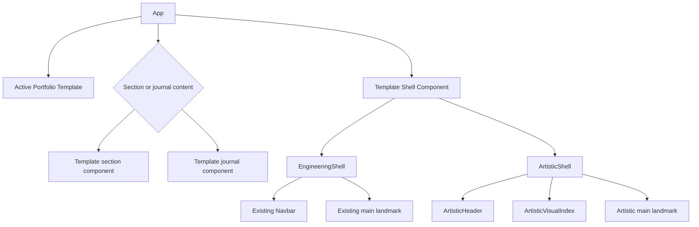

# Frontend Components - ATR-U1 Template Shell and Configuration Foundation

## Component Hierarchy



### Text Alternative

App resolves the active template and chooses section or journal content. It passes that rendered content into the template shell. EngineeringShell composes the existing Navbar and main region. ArtisticShell composes ArtisticHeader, ArtisticVisualIndex, and an artistic main landmark around the same App-selected content.

## App Orchestrator

### Location

`src/App.tsx`

### Responsibilities

- Resolve the active complete template from the registry.
- Build enabled navigation items and enabled section IDs once from shared data.
- Obtain active single-page section from `useActiveSection`.
- Obtain layout state and callbacks from `usePortfolioLayout`.
- Synchronize browser hash state for local journal routing.
- Select template section or journal content.
- Pass shell state, callbacks, and content to `ShellComponent`.

### Content Selection

```ts
const content = localJournalPostSlug
  ? <TemplateJournalPost slug={localJournalPostSlug} />
  : visibleSectionIds.map((sectionId) => {
      const SectionComponent = sectionComponents[sectionId]
      return <SectionComponent key={sectionId} />
    })
```

### Shell Active Section

- Use `journal` while any local journal slug is being rendered, including an unknown slug.
- Otherwise use the active section supplied by the shared layout hook.

### Error Boundaries

- An unknown template ID is resolved before App renders.
- An invalid section route resolves to the first enabled section.
- An unknown journal slug is passed to the template journal component rather than converted to a section fallback.

## PortfolioTemplate Contract

### Location

`src/templates/types.ts`

### Required Interface

```ts
type PortfolioTemplate = {
  id: PortfolioTemplateId
  label: string
  description: string
  ShellComponent: ComponentType<PortfolioShellProps>
  JournalPostComponent: ComponentType<JournalPostPageProps>
  chapterLabels: Record<SectionId, string>
  sectionComponents: Record<SectionId, ComponentType>
}
```

### Validation

- Both template definitions use `satisfies PortfolioTemplate`.
- Registry tests iterate every template and verify callable shell, journal, and section components.
- Tests verify labels and sections cover every configured `SectionId`.

## EngineeringShell

### Location

`src/templates/engineering/EngineeringShell.tsx`

### Props

Implements `PortfolioShellProps` without extensions.

### Render Behavior

1. Render the existing `Navbar` with active section, href resolver, navigation items, layout mode, navigation callback, and layout callback.
2. Render the existing main-region structure and multi-page top spacing.
3. Preserve `data-layout-mode`, `data-template-id`, and `data-testid="portfolio-main"` behavior.
4. Render `children` unchanged.

### Isolation

- Does not import artistic data, resolver output, components, or styles.
- Does not change current keyboard, route, or layout behavior.

## ArtisticShell

### Location

`src/templates/artistic/ArtisticShell.tsx`

### Props

Implements `PortfolioShellProps`.

### Local State

```ts
type ArtisticShellState = {
  isIndexOpen: boolean
  pendingFocusTarget?:
    | { kind: 'chapter'; sectionId: SectionId }
    | { kind: 'main' }
}
```

Activation mode may be held in a ref because it coordinates one focus transition rather than rendered state.

### Responsibilities

- Render the artistic root scope and template data attributes.
- Derive the active chapter label from `activeSection` and artistic labels.
- Own visual-index open/closed state.
- Compose `ArtisticHeader` and `ArtisticVisualIndex`.
- Render a focusable main landmark with stable test attributes.
- Complete pending focus after section or layout content mounts.
- Keep shell navigation available around section and journal content.

### Main Landmark Contract

- Use semantic `<main>`.
- Provide `tabIndex={-1}` so programmatic focus does not add it to normal tab order.
- Retain `data-layout-mode`, `data-template-id`, and `data-testid="portfolio-main"`.
- In multi-page mode, apply artistic header clearance rather than engineering Navbar spacing.

### Focus Completion

1. A keyboard index selection sets a pending chapter target before shared navigation.
2. After render/hash transition, query the stable destination root for a designated heading such as `[data-chapter-heading]`.
3. Focus that heading with `tabIndex={-1}`.
4. If the heading does not exist, focus the main landmark.
5. A layout change always uses the main-content target.
6. Clear pending focus after one successful or fallback attempt.

## ArtisticHeader

### Location

`src/templates/artistic/ArtisticHeader.tsx`

### Props

```ts
type ArtisticHeaderProps = {
  activeSection: SectionId
  chapterLabels: Record<SectionId, string>
  onOpenIndex: () => void
}
```

### Render Contract

- Show student identity from shared profile data.
- Show `chapterLabels[activeSection]` as current chapter context.
- Render a clearly named index trigger using an established menu/index icon and tooltip where needed.
- Maintain a stable trigger ref for Dialog return-focus behavior.
- Do not own navigation, layout, route, or theme state.

### States

- Default compact header.
- Current chapter changed after shared active-section updates.
- Index trigger expanded state exposed with `aria-expanded` and dialog relationship where supported.

## ArtisticVisualIndex

### Location

`src/templates/artistic/ArtisticVisualIndex.tsx`

### Props

```ts
type ArtisticVisualIndexProps = {
  open: boolean
  activeSection: SectionId
  layoutMode: LayoutMode
  navigationItems: EnabledNavigationItem[]
  chapterLabels: Record<SectionId, string>
  getNavigationHref: (sectionId: SectionId) => string
  onNavigate: (sectionId: SectionId) => void
  onToggleLayoutMode: () => void
  onClose: () => void
  onRequestDestinationFocus: (
    target: { kind: 'chapter'; sectionId: SectionId } | { kind: 'main' },
  ) => void
}
```

The final implementation may keep the focus callback private to ArtisticShell through composed handlers, but the ownership and event order must remain explicit.

### Dialog Behavior

- Use the installed Chakra Dialog API for modal semantics, initial focus, focus containment, Escape dismissal, and return focus.
- Render an explicit dialog title for assistive technology.
- Keep every enabled chapter reachable in DOM reading order.
- Display the active chapter with `aria-current="page"` or the equivalent and a non-color-only marker.
- Include existing color-mode controls and a two-state layout control.
- Use at least 44 by 44 CSS pixel touch targets where practical.

### Chapter Selection Event Order

#### Keyboard

1. Identify keyboard activation from the component event path.
2. Set pending destination focus for the selected section.
3. Invoke `onNavigate(sectionId)`.
4. Invoke `onClose()` without allowing default return-focus to override the pending destination.
5. ArtisticShell completes focus after destination content is available.

#### Pointer

1. Invoke `onNavigate(sectionId)`.
2. Invoke `onClose()`.
3. Do not programmatically focus the chapter.

### Layout Toggle Event Order

1. Set pending focus to the artistic main landmark.
2. Invoke `onToggleLayoutMode()`.
3. Close the index.
4. ArtisticShell focuses the main context after the layout transition.

### Dismissal Event Order

1. Close without setting pending destination focus.
2. Chakra Dialog restores focus to the index trigger.

## Template Registry

### Location

`src/templates/index.ts`

### Behavior

- Register engineering and artistic definitions as `PortfolioTemplate[]`.
- Resolve a matching ID without requiring App branches.
- Return engineering for unknown runtime input.
- Export the complete active definition.

### Tests

- Known engineering and artistic IDs resolve correctly.
- Unknown runtime input resolves engineering.
- Both definitions expose all contract members.
- Existing section maps remain complete.

## Artistic Chapter Labels

### Location

`src/templates/artistic/chapters.ts`

### Contract

```ts
const artisticChapterLabels = {
  home: 'Opening',
  about: 'Studio Statement',
  education: 'Formation',
  experience: 'Practice',
  awards: 'Recognition',
  projects: 'Selected Works',
  gallery: 'Visual Archive',
  journal: 'Process Notes',
  skills: 'Materials',
  contact: 'Closing',
} satisfies Record<SectionId, string>
```

The engineering definition supplies its own complete labels, normally matching shared navigation labels.

## Artistic Presentation Resolver

### Location

`src/templates/artistic/presentation.ts`

### Public Functions

```ts
resolveArtisticPresentation(
  config: ArtisticPresentationConfig,
  portfolio: Portfolio,
): ResolvedArtisticPresentation

resolveFeaturedProjects(
  projects: readonly ProjectEntry[],
  requestedIds?: readonly string[],
): ProjectEntry[]

resolveGalleryTreatment(
  item: GalleryItem,
  index: number,
  configured?: GalleryTreatment,
): GalleryTreatment

resolveArtisticAccent(accent?: ArtisticAccent): ArtisticAccent
```

### Component Rules

- Functions are pure and independently testable.
- Resolver output is complete; consuming components do not repeat fallback branches.
- Unknown IDs and values do not throw.
- Shared arrays and records are not mutated.

## Student Artistic Configuration

### Location

`src/data/artistic.ts`

### Behavior

- Export one object satisfying `ArtisticPresentationConfig`.
- Permit every field to be omitted.
- Reference projects and gallery items by stable IDs.
- Offer only supported accent and treatment tokens through TypeScript.
- Keep this module presentation-only and separate from core portfolio data.

## Shared Service Integration

| Service | Owner | Shell Usage |
|---|---|---|
| `usePortfolioLayout` | App | Shell invokes callbacks and presents returned state. |
| `useActiveSection` | App | ArtisticHeader maps returned ID to its chapter label. |
| `parseJournalPostHash` | App/shared utility | Selects template journal content before section fallback. |
| Color mode | Existing Chakra provider/hook | Visual index presents the existing mode control. |
| `scrollToSection` | Shared layout utility | Invoked through `onNavigate`, never duplicated by ArtisticShell. |

## Responsive and Accessibility States

| Component | Mobile | Desktop | Keyboard/Focus |
|---|---|---|---|
| ArtisticHeader | Compact identity, current chapter, reachable index icon | Same information with wider spacing | Visible trigger focus and expanded state. |
| VisualIndex | Full viewport, vertical chapter list, reachable controls | Full viewport editorial index with stable columns | Trapped while open; Escape closes; current item announced. |
| Artistic main | Header-safe padding and no clipped content | Constrained editorial content width as chapters require | Programmatically focusable fallback landmark. |
| EngineeringShell | Existing responsive Navbar behavior | Existing behavior | No regression. |

## Component Test Matrix

| Component | Required Scenarios |
|---|---|
| App | Both shell definitions; single and multi layouts; section and journal routes; invalid hash fallback. |
| EngineeringShell | Existing Navbar props, main spacing, children, and data attributes. |
| ArtisticShell | Header/index composition, active chapter mapping, pending-focus completion, children, and layout attributes. |
| ArtisticHeader | Identity, current label, trigger semantics, and open callback. |
| ArtisticVisualIndex | Enabled destinations, current state, keyboard selection, pointer selection, Escape, close, layout toggle, and focus behavior. |
| Registry | Complete contract, known IDs, and engineering fallback. |
| Presentation resolver | Complete, absent, blank, partial, unknown, duplicate, and immutable input cases. |
| Shared project data | Stable ID presence and uniqueness. |

## Out-of-Scope Components for ATR-U1

- Final editorial chapter compositions.
- Horizontal rail and gallery preview behavior.
- Motion/reveal implementation beyond shell-compatible boundaries.
- Final artistic journal article styling.
- Student README and full cross-viewport release verification.

These belong to ATR-U2 or ATR-U3 and consume the contracts established here.

## Extension Rule Compliance

| Extension | Status | Rationale |
|---|---|---|
| Security Baseline | Disabled | Disabled during Requirements Analysis; no security extension constraints apply. |
| Property-Based Testing | Disabled | Disabled during Requirements Analysis; component behavior uses focused example-based tests. |
