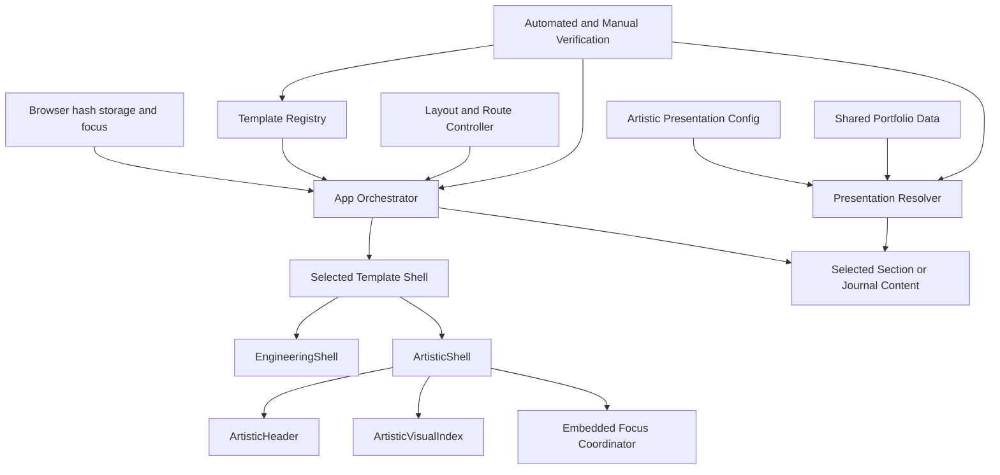

# Logical Components - ATR-U1 Template Shell and Configuration Foundation

## Purpose

Define the logical components that implement ATR-U1's approved functional and non-functional patterns without adding infrastructure services or a second application architecture.

## Logical Architecture



### Text Alternative

Browser hash, storage, and focus state enter through App and the existing Layout and Route Controller. The Template Registry supplies a complete selected template. App chooses section or journal content and passes it into the selected shell. EngineeringShell preserves the existing engineering frame. ArtisticShell composes its header, visual index, and embedded Focus Coordinator. The pure Presentation Resolver combines optional artistic configuration with shared portfolio data for artistic content. Automated and manual verification checks App, registry, resolver, shells, routes, focus, and responsive behavior.

## Component Summary

| Component | Runtime Location | Responsibility | State |
|---|---|---|---|
| App Orchestrator | React client | Compose shared route/layout state with selected template capabilities and content. | Current hash mirror plus hook state inputs. |
| Template Registry | Static TypeScript module | Resolve complete template definitions and engineering fallback. | None. |
| Layout and Route Controller | Existing hook/utilities | Own layout mode, routed section, hashes, storage guards, and active-section source. | Layout and active section. |
| EngineeringShell | React client | Preserve existing Navbar and main-region behavior behind shell props. | None beyond child components. |
| ArtisticShell | React client | Own artistic framing, visual-index open state, and pending focus intent. | Index open/closed and one focus intent. |
| ArtisticHeader | React client | Present identity, active chapter, and index trigger. | None. |
| ArtisticVisualIndex | React client | Present accessible enabled destinations, current state, theme/layout controls, and selection events. | Dialog/framework interaction state as composed by shell. |
| Embedded Focus Coordinator | ArtisticShell effect/ref logic | Complete one post-navigation or post-layout focus transition. | Single-use pending intent. |
| Artistic Presentation Config | Static student data | Hold optional statement, featured IDs, treatments, and accent token. | None at runtime. |
| Presentation Resolver | Pure TypeScript module | Produce complete immutable artistic presentation data with linear fallbacks. | None. |
| Scoped Artistic Style Layer | CSS/Chakra presentation | Encode responsive shell/index dimensions, tokens, contrast, and focus states. | Color mode through existing provider. |
| Verification Boundary | Development/build tooling | Prove contracts, behavior, accessibility state, fallbacks, bundle budget, and responsive checks. | Test fixtures and recorded evidence only. |

## App Orchestrator

**Implementation surface**: `src/App.tsx`

### Inputs

- Active `PortfolioTemplate` from the registry.
- Shared navigation data.
- `useActiveSection` output.
- `usePortfolioLayout` state and callbacks.
- Current browser hash for local journal classification.

### Outputs

- `PortfolioShellProps` to the selected shell.
- Template-specific section sequence, one routed section, or one journal component as `children`.

### NFR Responsibilities

| Category | Responsibility |
|---|---|
| Performance | Render all enabled sections only in single-page mode and one section in multi-page mode. |
| Reliability | Keep journal-prefix classification ahead of invalid section fallback. |
| Maintainability | Avoid template-ID visual conditionals; use template capabilities. |
| Testability | Expose stable template/layout/main attributes and deterministic content selection. |

### Constraints

- Does not own artistic index state or focus policy.
- Does not import artistic configuration directly.
- Does not duplicate layout or hash behavior already in shared hooks.

## Template Registry

**Implementation surface**: `src/templates/index.ts` and `src/templates/types.ts`

### Responsibilities

- Define the complete `PortfolioTemplate` contract.
- Register engineering and artistic template definitions.
- Resolve a known ID.
- Return engineering for an unknown runtime value.
- Keep label and section maps complete for every `SectionId`.

### NFR Responsibilities

| Category | Responsibility |
|---|---|
| Resilience | Deterministic unknown-ID fallback. |
| Maintainability | One typed substitutability boundary. |
| Isolation | App selects behavior without scattered branches. |
| Testability | Registry iteration supports complete contract tests. |

### Failure Policy

- Unknown runtime ID: recover to engineering.
- Missing developer-owned capability: fail TypeScript or contract tests.

## Layout and Route Controller

**Implementation surface**: `src/hooks/usePortfolioLayout.ts`, `src/utils/scroll.ts`, and `src/utils/journal.ts`

### Responsibilities

- Preserve single/multi layout state.
- Resolve valid/invalid section IDs.
- Generate mode-aware hashes and navigation callbacks.
- Guard layout preference reads and writes.
- Track the current single-page section.
- Parse local journal route prefixes and slugs.

### NFR Responsibilities

| Category | Responsibility |
|---|---|
| Static compatibility | Emit hash routes that need no server rewrite. |
| Reliability | Degrade on invalid hash or unavailable storage. |
| Privacy | Persist only `single` or `multi`. |
| Maintainability | Remain shared and template-agnostic. |

### Constraint

No artistic-only route controller or active-section observer is added.

## EngineeringShell

**Implementation surface**: `src/templates/engineering/EngineeringShell.tsx`

### Responsibilities

- Render existing Navbar with unchanged behavior and shell-provided props.
- Preserve engineering main spacing and existing data/test attributes.
- Render App-selected children unchanged.

### NFR Responsibilities

| Category | Responsibility |
|---|---|
| Regression safety | Preserve current engineering behavior. |
| Isolation | Import no artistic config, resolver, component, or style module. |
| Maintainability | Act as a narrow adapter, not a second orchestrator. |

## ArtisticShell

**Implementation surface**: `src/templates/artistic/ArtisticShell.tsx`

### Responsibilities

- Render artistic root scope, header, visual index, and main landmark.
- Derive active chapter label from shell props and chapter map.
- Own visual-index open/closed state.
- Hold one pending focus intent.
- Complete focus after route/layout content renders.
- Preserve artistic shell around local journal content.

### State Model

```ts
type ArtisticShellState = {
  isIndexOpen: boolean
  pendingFocusIntent:
    | { kind: 'chapter'; sectionId: SectionId }
    | { kind: 'main' }
    | null
}
```

The exact implementation may use state for open/closed and a ref or state for the focus intent. The behavior must remain observable by the completion effect and clear after one attempt.

### NFR Responsibilities

| Category | Responsibility |
|---|---|
| Accessibility | Main landmark, destination focus, and dismissal coordination. |
| Performance | Event-driven local state with no polling or persistent measurement. |
| Responsive behavior | Apply scoped shell spacing and stable main offset. |
| Isolation | Contain artistic framing without changing engineering. |

## Embedded Focus Coordinator

**Implementation surface**: effect and refs inside `ArtisticShell`; it is a logical responsibility, not a separate runtime service.

### Inputs

- Pending focus intent.
- Current active section.
- Current layout mode.
- Rendered children/destination availability.
- Refs to artistic main and index trigger.

### Algorithm

1. Exit when no intent exists.
2. For chapter intent, locate `#sectionId [data-chapter-heading]` or an equivalent scoped target.
3. For main intent, use the artistic main ref.
4. If chapter target is missing, use the main ref.
5. Focus the chosen target once.
6. Clear the intent.
7. Cancel a scheduled animation frame during cleanup if one was required.

### Constraints

- No fixed timeout.
- No repeated query loop.
- No pointer-selection focus override.
- No trigger-return focus after keyboard destination selection.
- Focus targets use `tabIndex={-1}` and remain outside normal tab order.

## ArtisticHeader

**Implementation surface**: `src/templates/artistic/ArtisticHeader.tsx`

### Responsibilities

- Present shared profile identity.
- Present `chapterLabels[activeSection]`.
- Render an accessible index trigger with stable trigger identity/ref.
- Expose expanded/dialog relationship state where supported.

### NFR Responsibilities

- Keep the trigger at least 44 by 44 CSS pixels where practical.
- Retain visible focus and AA-compatible state contrast.
- Fit identity and chapter context at 320 CSS pixels through wrapping/truncation rules that do not hide essential identity.

## ArtisticVisualIndex

**Implementation surface**: `src/templates/artistic/ArtisticVisualIndex.tsx`

### Responsibilities

- Compose the installed Chakra 3 Dialog primitives.
- Render every enabled destination in navigation order.
- Map stable IDs to artistic labels.
- Expose current chapter programmatically and visually.
- Present theme and layout controls through their existing owners.
- Report chapter selection activation mode to ArtisticShell handlers.
- Close on Escape, close action, backdrop behavior where supported, chapter selection, or layout toggle.

### Event Contract

| Event | Callback Order | Focus Owner |
|---|---|---|
| Open | Set open state | Chakra initial focus. |
| Escape/close | Close only | Chakra returns trigger focus. |
| Keyboard chapter | Set chapter intent, navigate, close | Embedded Focus Coordinator. |
| Pointer chapter | Navigate, close | Natural browser behavior. |
| Layout toggle | Set main intent, toggle layout, close | Embedded Focus Coordinator. |

### Responsive Structure

- One semantic dialog tree for all viewport sizes.
- Mobile-first single-column flow with wrapping labels.
- Explicit desktop grid tracks at existing project breakpoints.
- Scrollable dialog body when viewport height is constrained.
- Header/close and control regions remain reachable while content scrolls.

## Artistic Presentation Config

**Implementation surface**: `src/data/artistic.ts`

### Responsibilities

- Export one object satisfying `ArtisticPresentationConfig`.
- Accept optional creative statement, ordered project IDs, gallery treatment record, and accent token.
- Reference shared content by stable ID.

### Constraints

- No duplicated project/gallery/profile objects.
- No raw HTML.
- No arbitrary CSS values.
- No runtime persistence or remote loading.

## Presentation Resolver

**Implementation surface**: `src/templates/artistic/presentation.ts`

### Logical Subcomponents

| Function | Responsibility |
|---|---|
| Statement resolver | Trim explicit input and apply fixed shared-data fallback order. |
| Featured project resolver | Build `Map`, deduplicate with `Set`, preserve requested order, and fall back to shared order. |
| Gallery treatment resolver | Resolve supported explicit token or stable index fallback. |
| Accent resolver | Resolve supported token or default. |
| Aggregate resolver | Return one complete immutable presentation object. |

### NFR Responsibilities

| Category | Responsibility |
|---|---|
| Scalability | `O(P + R + G)` bounded work for projects, references, and gallery items. |
| Reliability | Complete deterministic output for partial or invalid config. |
| Security | Closed runtime guards and no direct style injection. |
| Performance | Synchronous pure work with no React/browser/network dependency. |
| Testability | Independent functions and representative 100-item fixtures. |

## Scoped Artistic Style Layer

**Implementation surface**: artistic component style props and artistic-scoped CSS in the existing style organization.

### Responsibilities

- Define compact header height/offset tokens.
- Define index mobile/desktop grids.
- Define stable control dimensions and label wrapping.
- Define light/dark surface, text, active, and focus token mappings.
- Keep selectors under the artistic root or component scope.

### Constraints

- No viewport-width font scaling.
- No layout mode determined in JavaScript.
- No engineering selector override.
- No arbitrary configured CSS string.
- No page-level horizontal overflow at representative widths.

## Verification Boundary

**Implementation surface**: existing test files plus focused new tests and AI-DLC code/build evidence.

### Automated Test Groups

| Group | Primary Surface |
|---|---|
| Registry contract | `src/templates/templateRegistry.test.ts` or focused companion. |
| Portfolio IDs | Existing portfolio data validation tests. |
| Resolver | Focused `presentation.test.ts`. |
| Engineering shell | Shell component test or App regression test. |
| Artistic shell/header/index | Focused React Testing Library tests. |
| App routes/layout | Existing `App.test.tsx` expanded with template fixtures. |

### Reusable Fixtures

- Complete minimal `PortfolioTemplate` fixture.
- Enabled/disabled navigation sets.
- Valid and invalid browser hash setup/cleanup.
- Chapter root with designated focus heading.
- Main landmark fallback.
- Complete, partial, absent, unknown, duplicate, and 100-item resolver inputs.

### Build and Manual Evidence

- Record pre/post JavaScript gzip totals and percentage change.
- Record test, type/build, lint, and production build results.
- Record 320, 768, 1024, and 1440 CSS pixel checks.
- Record light/dark focus and contrast checks.
- Record keyboard dismissal, focus containment, chapter destination, and layout-toggle focus.
- Record available evergreen desktop/mobile browser smoke checks.

## Dependency and Communication Matrix

| Component | Depends On | Communication | Must Not Depend On |
|---|---|---|---|
| App | Registry, layout/route controller, template contract | Direct typed imports and props | Artistic visual implementation details. |
| Registry | Engineering and artistic definitions | Typed lookup | Browser state or portfolio mutation. |
| EngineeringShell | Navbar and shell props | Props and children | Artistic modules/config/styles. |
| ArtisticShell | Header, index, labels, shell props | Props, callbacks, local state | Hash parsing or storage access. |
| Focus Coordinator | Shell refs/state and rendered DOM | Effect and refs | Timer service or global event bus. |
| Visual Index | Chakra Dialog, shell handlers, shared mode callbacks | Props and user events | Direct History/storage mutation. |
| Presentation Resolver | Config and shared portfolio data | Pure function calls | React, DOM, network, storage. |
| Scoped styles | Artistic root and token maps | Classes/style props | Engineering selectors or raw config values. |

## Infrastructure Components

No infrastructure components are required.

| Component Type | Decision | Rationale |
|---|---|---|
| Backend service | Not required | All content and configuration are build-time static. |
| Database/object store | Not required | Existing repository data remains the source of truth. |
| Queue/event broker | Not required | UI events are synchronous local callbacks. |
| Cache | Not required | Approved content scale is handled by bounded pure functions. |
| Circuit breaker/retry service | Not required | There are no remote runtime operations in ATR-U1. |
| Service worker | Not required | Offline behavior is not approved scope. |
| CDN/autoscaling component | Not application-managed | GitHub Pages owns static delivery capacity. |
| Monitoring/analytics service | Not required | Approved privacy boundary excludes production telemetry. |
| Deployment workflow change | Not required | Existing Vite/GitHub Pages output remains compatible. |

## NFR Traceability

| Logical Component | Primary NFR Coverage |
|---|---|
| App Orchestrator | ATR1-NFR-PERF-05, REL-02, REL-03, MAINT-01, TEST-04 |
| Template Registry | ATR1-NFR-REL-01, REL-06, MAINT-01, TEST-01 |
| Layout and Route Controller | ATR1-NFR-SCAL-03, REL-02 through REL-04, SEC-03 |
| EngineeringShell | ATR1-NFR-REL-07, MAINT-04, MAINT-05 |
| ArtisticShell/Focus Coordinator | ATR1-NFR-PERF-02, PERF-06, A11Y-04 through A11Y-06, A11Y-10 |
| ArtisticVisualIndex | ATR1-NFR-A11Y-01 through A11Y-09, RESP-01 through RESP-03 |
| Presentation Resolver | ATR1-NFR-SCAL-04, SCAL-05, PERF-03, REL-05, SEC-04, SEC-05 |
| Scoped Artistic Style Layer | ATR1-NFR-A11Y-08, A11Y-09, RESP-01 through RESP-04, ATR1-NFR-COMPAT-01, ATR1-NFR-COMPAT-02 |
| Verification Boundary | ATR1-NFR-PERF-04, REL-08, TEST-01 through TEST-06 |

## Content Validation

| Check | Result |
|---|---|
| Mermaid diagram | Uses alphanumeric node IDs and valid flowchart connections. |
| Diagram alternative | Complete text alternative is included. |
| TypeScript block | Balanced fence and illustrative typed state. |
| Markdown tables | Valid simple pipe tables. |
| Infrastructure applicability | Every required category is explicitly included or excluded with rationale. |

## Extension Rule Compliance

| Extension | Status | Rationale |
|---|---|---|
| Security Baseline | Disabled | Full extension components do not apply; approved static security ownership is represented. |
| Property-Based Testing | Disabled | Verification uses focused fixtures and representative scale examples. |
