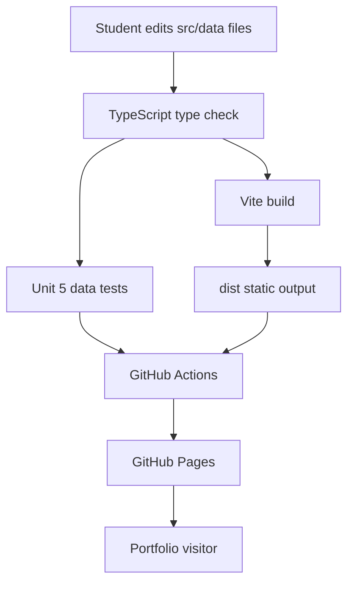

# Deployment Architecture - Template Data And Shared Types

## Architecture Overview

Unit 1 contributes static TypeScript data and asset references to the existing React/Vite app. During deployment, Vite bundles the data into the JavaScript output and emits referenced assets into `dist/`. GitHub Actions deploys the built static output to GitHub Pages.

## Deployment Diagram



## Text Alternative

Students edit `src/data` files. TypeScript checks data shape and Vite resolves asset imports. Unit 5 tests validate semantic data rules. GitHub Actions builds and uploads `dist/`. GitHub Pages serves the static portfolio to visitors.

## Environment Mapping

| Environment | Data Source | Build Tool | Hosting |
|---|---|---|---|
| Local development | `src/data/*.ts` | Vite dev server | Local browser |
| Pull request or local verification | `src/data/*.ts` | TypeScript, Vite, Vitest | No hosting required |
| Production | Bundled data in static assets | GitHub Actions + Vite | GitHub Pages |

## Deployment Responsibilities By Unit

| Responsibility | Owning Unit |
|---|---|
| Define static data and asset imports | Unit 1 |
| Render data in UI | Unit 2 |
| Configure Vite/GitHub Pages base path | Unit 3 |
| Document setup/deployment | Unit 4 |
| Validate data and app rendering | Unit 5 |

## Data Layer Deployment Constraints

- Data must be available at build time.
- Asset references must be Vite-resolvable.
- No environment secrets are required for data.
- No runtime content fetch is allowed.
- No server-side rendering or backend compute is required.

## CI Validation Design

Later Code Generation and Unit 5 should ensure CI can run:

```bash
npm ci
npm run lint
npm run test
npm run build
```

If test setup is added after deployment workflow changes, the workflow should include `npm run test` before `npm run build`.

## Static Hosting Portability

Although GitHub Pages is the primary target, Unit 1 data remains portable to static hosts such as Netlify, Vercel static export, Cloudflare Pages, or S3 static hosting because:

- Data is bundled at build time.
- There is no GitHub-specific data runtime.
- Base path concerns are handled by build/deployment configuration.

## Extension Rule Compliance

| Extension | Status | Rationale |
|---|---|---|
| Security Baseline | Disabled | User opted out during Requirements Analysis. |
| Property-Based Testing | Disabled | User opted out during Requirements Analysis. |
