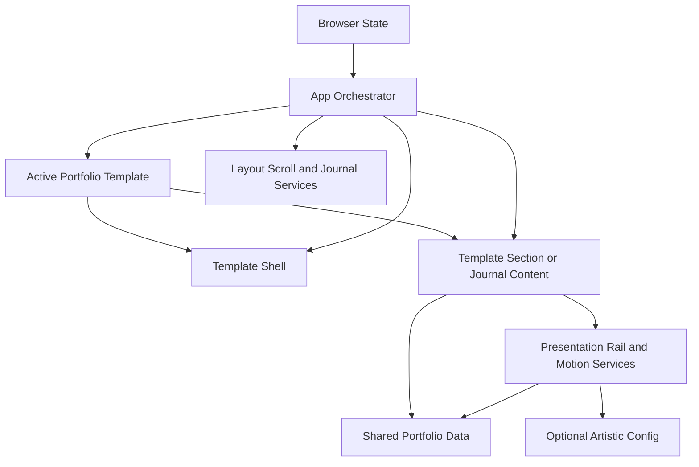

# Application Design - Artistic Template Presentation Redesign

## Design Summary

The redesign extends the existing template strategy from section substitution to full presentation composition. `App` remains responsible for browser hash state, layout mode, enabled navigation, active section, and local journal route resolution. The selected `PortfolioTemplate` supplies a typed Shell, complete section map, local journal view, and artistic or engineering chapter labels.

The engineering template receives a thin `EngineeringShell` adapter around the current Navbar and main region. The artistic template receives an `ArtisticShell` with a compact header, accessible full-screen visual index, editorial chapter framing, native horizontal rails, progressive motion, and artistic journal reading treatment. Both presentations consume the same portfolio data.

## Approved Decisions

| Decision | Approved Design |
|---|---|
| Shell ownership | Each template supplies a typed Shell; App owns browser and layout state. |
| Chapter routing | Preserve all existing `SectionId` values and hashes; map them to artistic labels and components. |
| Artistic metadata | Store optional presentation settings in typed `src/data/artistic.ts` and reference stable content IDs. |
| Interaction implementation | Use local React hooks, native horizontal scrolling, browser observers, CSS transitions, and reduced-motion preferences; add no animation dependency. |

## High-Level Architecture

### Text Alternative

Browser state enters App. App uses shared layout, scroll, and journal services and resolves the active template. The template supplies the shell and visible content. App passes shared state and rendered content into the shell. Content uses shared portfolio data; artistic content additionally uses optional artistic configuration through pure presentation, rail, and motion services.

## Template Contract

The expanded `PortfolioTemplate` contract owns:

- `ShellComponent: ComponentType<PortfolioShellProps>`
- `JournalPostComponent: ComponentType<JournalPostPageProps>`
- `chapterLabels: Record<SectionId, string>`
- `sectionComponents: Record<SectionId, ComponentType>`
- Existing template `id`, `label`, and `description`

`PortfolioShellProps` carries active section, layout mode, enabled navigation, href generation, navigation callback, layout-toggle callback, and App-rendered children. The Shell does not own hash parsing, history mutation, or layout storage.

## Presentation Composition

### Engineering

- `EngineeringShell` renders the current Navbar and main region.
- Existing engineering sections and `JournalPostPage` remain in use.
- Current single/multi-page behavior and test IDs remain stable.
- Engineering does not import artistic code or configuration.

### Artistic

- `ArtisticShell` renders the compact header, full-screen visual index, and editorial main region.
- `ArtisticHeader` presents identity, active chapter, and index trigger.
- `ArtisticVisualIndex` presents all enabled destinations plus color and layout controls through accessible Chakra Dialog behavior.
- Every existing route ID maps to a dedicated artistic component and label.
- `ArtisticJournalPostPage` reuses shared slug/content resolution with an artistic article layout.

## Artistic Chapter Map

| Stable Route ID | Artistic Label | Owning Component |
|---|---|---|
| `home` | Opening | `ArtisticOpeningStatement` |
| `about` | Studio Statement | `ArtisticStudioStatement` |
| `education` | Formation | `ArtisticFormation` |
| `experience` | Practice | `ArtisticPractice` |
| `awards` | Recognition | `ArtisticRecognition` |
| `projects` | Selected Works | `ArtisticSelectedWorks` |
| `gallery` | Visual Archive | `ArtisticVisualArchive` |
| `journal` | Process Notes | `ArtisticProcessNotes` |
| `skills` | Materials | `ArtisticMaterials` |
| `contact` | Closing | `ArtisticClosingContact` |

Related chapters may appear visually continuous in single-page mode, but they retain independent roots, enabled navigation behavior, and direct hashes. Multi-page mode renders one mapped component at a time.

## Artistic Presentation Data

### Core Data

Profile, hero, about, education, experience, awards, projects, gallery, writing, skills, certificates, and contact information remain in existing shared data modules.

### Stable Identity

`ProjectEntry` gains a stable unique `id` so artistic featured-work configuration does not depend on mutable titles. Gallery items already have stable IDs. Tests validate uniqueness and non-empty identifiers.

### Optional Config

`src/data/artistic.ts` exports `ArtisticPresentationConfig` with optional:

- Creative statement override.
- Ordered featured project IDs.
- Gallery treatment by gallery item ID.
- Supported artistic accent token.

### Resolver

Pure resolver functions combine optional config with shared-data fallbacks. Unknown IDs are ignored safely; an empty result falls back to configured project order. Missing gallery treatment uses a deterministic item/index default. Missing or unknown accent uses the default professional palette.

## Interaction Design Boundaries

### Visual Index

- Chakra Dialog provides focus entry, containment, Escape dismissal, and return-focus behavior.
- Navigation and layout events call App-provided callbacks.
- Current chapter uses `aria-current` or an equivalent programmatic state and a non-color-only visual treatment.
- The index owns only local open/closed state.

### Horizontal Rails

- `ArtisticRail<T>` renders a native overflow container with CSS scroll snap.
- `useHorizontalRail` owns element ref, previous/next availability, target calculation, and optional keyboard shortcuts.
- Visible icon controls provide accessible names and disable correctly at boundaries.
- No vertical wheel interception is implemented.
- Selected Works and Visual Archive share the primitive but provide separate item renderers and sizing modes.

### Motion

- `useMotionPreference` listens to `prefers-reduced-motion`.
- `ArtisticReveal` and `useInViewReveal` progressively add effects without withholding essential content.
- Normal motion is limited to transform and opacity-based entrance, subtle image movement, and transitions.
- Reduced-motion mode disables parallax, continuous motion, smooth spatial movement, and large transforms.
- Rail scrolling uses immediate behavior when reduced motion is requested.

## Shared Behavior Preservation

- `usePortfolioLayout` remains the single owner of layout persistence and hash generation.
- `useActiveSection` remains the single-page active section source.
- `parseJournalPostHash` and local journal registry remain shared.
- Resume download, external links, certificate previews, video URLs, and mailto contact behavior continue using existing data and helpers.
- GitHub Pages base-path and deployment workflow do not change.

## Component and Service Ownership

| Capability | Owner |
|---|---|
| Template selection and fallback | Template Registry Service |
| Browser/hash/layout orchestration | App and Layout/Route Service |
| Engineering framing | EngineeringShell |
| Artistic framing and local index state | ArtisticShell |
| Chapter identity and navigation labels | Artistic chapter label mapping |
| Optional artistic metadata fallback | Artistic Presentation Resolver |
| Horizontal scrolling and boundaries | ArtisticRail and Horizontal Rail Controller |
| Reduced-motion and reveal state | Motion Preference and Reveal Service |
| Local post route/content | Shared Journal Route and Content Service |
| Artistic local post presentation | ArtisticJournalPostPage |
| Color mode | Existing Chakra color mode helpers |
| Automated and visual verification | Test orchestration and Build/Test stage |

## Requirement Ownership

| Requirement Group | Design Owner |
|---|---|
| FR-01, FR-02, FR-26 | Template contract, registry, EngineeringShell, and shared data |
| FR-03, FR-08 through FR-12 | Artistic chapter components and ArtisticChapterFrame |
| FR-04 through FR-07 | PortfolioShell contract, ArtisticShell, ArtisticHeader, and ArtisticVisualIndex |
| FR-13 through FR-15 | ArtisticRail and Horizontal Rail Controller |
| FR-16 through FR-18 | Motion Preference and Reveal Service |
| FR-19 through FR-23 | App, Layout/Route Service, template JournalPostComponent, and journal route service |
| FR-24, FR-25 | Artistic Presentation Config and Resolver |
| FR-27 | Existing shared actions plus artistic chapter renderers |
| FR-28 | Unit 3 student documentation |
| NFR-01 through NFR-06 | Visual Index, ArtisticRail, motion service, semantic chapter components, and accessibility tests |
| NFR-07 through NFR-09 | Shell, ChapterFrame, rail sizing, responsive component design, and visual checks |
| NFR-10 through NFR-14 | Static architecture, lazy media, CSS motion, no new animation dependency, and build verification |
| NFR-15 through NFR-20 | Typed contracts, scoped artistic modules, pure fallbacks, regression tests, and viewport verification |

## Story Group Ownership

| Story Group | Components and Services |
|---|---|
| US-01 | Template Registry, artistic config, presentation resolver, stable project identity |
| US-02 through US-04 | ArtisticShell, Header, VisualIndex, Opening, ChapterFrame, chapter labels |
| US-05 and US-06 | ArtisticRail, rail controller, Selected Works, Visual Archive |
| US-07 through US-10 | Formation, Practice, Recognition, Process Notes, Materials, Closing Contact, artistic journal page |
| US-11 | Motion preference, reveal service, artistic CSS |
| US-12 | App, layout service, Shell contract, journal route service |
| US-13 | EngineeringShell, registry tests, interaction tests, visual checks, README |

## Unit Alignment

### Unit 1: Template Shell and Configuration Foundation

- PortfolioTemplate and PortfolioShell contracts.
- EngineeringShell and ArtisticShell.
- ArtisticHeader and ArtisticVisualIndex.
- Chapter labels, stable project IDs, artistic config, and presentation resolver.
- App integration and shell-focused tests.

### Unit 2: Artistic Exhibition and Interaction System

- ArtisticChapterFrame and all artistic route components.
- ArtisticRail and horizontal rail hook.
- Motion preference, reveal hooks, and artistic styling.
- ArtisticJournalPostPage and behavior-preserving actions.
- Interaction and content-completeness tests.

### Unit 3: Verification and Student Enablement

- Cross-template and route regression tests.
- Desktop/mobile, light/dark, reduced-motion, and horizontal-overflow visual checks.
- Student template and artistic metadata documentation.
- Final integrated quality fixes that do not introduce new feature scope.

## Deferred Functional Design Decisions

- Exact rail target calculation, resize tolerance, and keyboard key mapping.
- Visual-index focus target and destination focus behavior after navigation.
- Detailed metadata fallback ordering and duplicate-ID handling.
- Active chapter thresholds in artistic single-page mode if existing defaults need adjustment.
- Observer thresholds, reveal state persistence, parallax limits, and reduced-motion transitions.
- Exact article return behavior across single-page and multi-page modes.

## Validation Strategy

- Compile-time completeness for shell, section, chapter label, and journal contracts.
- Pure unit tests for presentation resolution and rail target helpers.
- DOM interaction tests for visual-index focus, dismissal, navigation, and controls.
- App integration tests for both templates, layout modes, and local journal routes.
- Motion tests with deterministic `matchMedia` mocks.
- Responsive browser screenshots and pixel/content checks for desktop and mobile.
- Existing `npm run test`, TypeScript, lint, and production build gates.

## Extension Rule Compliance

| Extension | Status | Rationale |
|---|---|---|
| Security Baseline | Disabled | Disabled during Requirements Analysis; no security extension constraints apply. |
| Property-Based Testing | Disabled | Disabled during Requirements Analysis; no PBT extension constraints apply. |
