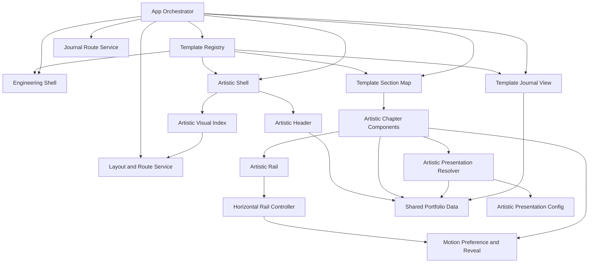
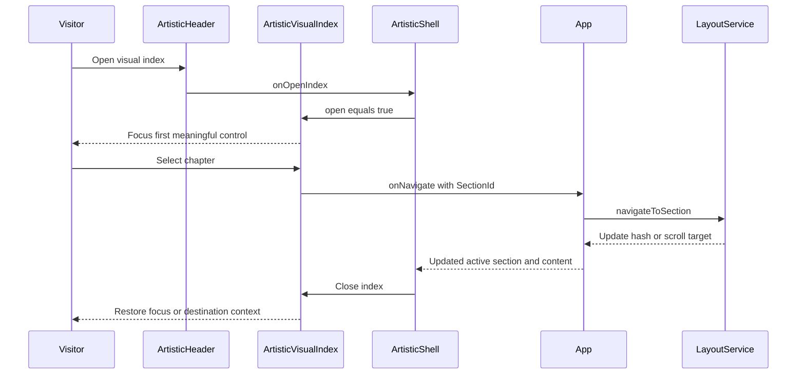
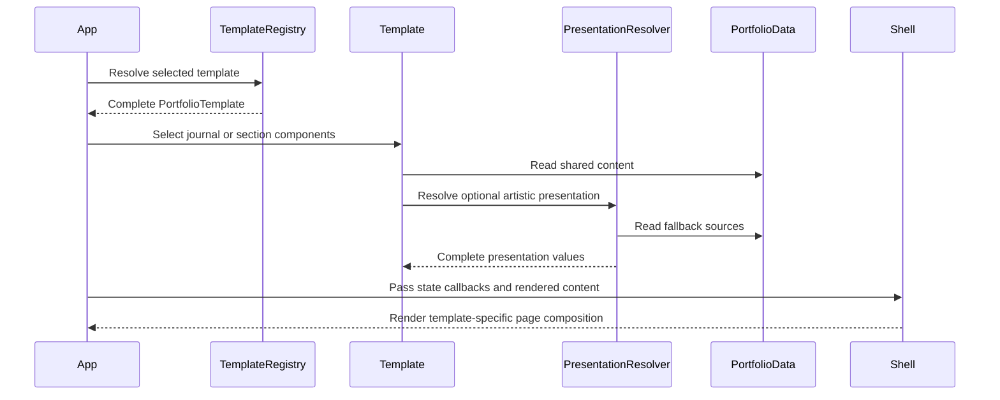

# Component Dependencies - Artistic Template Presentation Redesign

## Dependency Diagram

### Text Alternative

App depends on the template registry, shared layout service, and journal route service. The registry supplies engineering or artistic shells, section maps, and journal views. ArtisticShell composes the artistic header and visual index. Artistic chapters consume shared portfolio data and resolved artistic presentation configuration. Selected Works and Visual Archive use ArtisticRail, whose controller uses motion preference for scroll behavior. Journal route parsing remains shared while each template provides its own journal view.

## Dependency Matrix

| Component | Depends On | Communication | Change Scope |
|---|---|---|---|
| App Orchestrator | Registry, layout hook, scroll hook, journal parser | Direct imports and typed props | Major internal composition change |
| PortfolioTemplate | Shell, section map, journal component, chapter labels | Typed contract | Major compatible extension after definitions update |
| EngineeringShell | Existing Navbar, shell props | Props and children | Small adapter preserving behavior |
| ArtisticShell | Header, visual index, shell props, chapter labels | Props, callbacks, children | New major presentation component |
| ArtisticHeader | Profile data, active section, chapter labels | Props and shared static data | New component |
| ArtisticVisualIndex | Navigation items, layout mode, callbacks, color mode | Props and Chakra Dialog state | New component |
| Artistic Chapters | Shared data, presentation resolver, shared actions | Static imports and component props | New/replacement artistic components |
| ArtisticRail | Rail controller, rendered items | Generic props and hook state | New shared artistic primitive |
| Rail Controller | DOM geometry, motion preference | Ref and callbacks | New local hook |
| ArtisticReveal | Motion preference, visibility observer | Props and local hook | New shared artistic primitive |
| Presentation Resolver | Artistic config, shared portfolio data | Pure function inputs/outputs | New pure module |
| ArtisticJournalPostPage | Journal registry and shared helpers | Slug prop and static lookup | New template presentation |
| Tests | All contracts and interactions | Render helpers and mocks | Expanded coverage |

## Communication Patterns

### State Down, Events Up

- App passes active section, layout mode, navigation items, href generation, navigation callback, and layout-toggle callback to the active Shell.
- ArtisticShell passes relevant state into Header and VisualIndex.
- VisualIndex reports navigation and layout events through callbacks; it does not mutate browser state directly.

### Static Data Plus Pure Resolution

- Artistic components import shared typed data as existing components do.
- Optional `artistic.ts` configuration is passed with shared portfolio data into pure resolver functions.
- Resolvers return complete display-ready values and do not mutate inputs.

### Local Interaction State

- Visual-index open state remains inside ArtisticShell or a dedicated local hook.
- Rail boundary state remains inside each ArtisticRail through `useHorizontalRail`.
- Visibility/reveal state remains inside ArtisticReveal through `useInViewReveal`.
- No global state library is introduced.

## Navigation Sequence

### Text Alternative

The visitor opens the index from ArtisticHeader. ArtisticShell opens ArtisticVisualIndex and focus enters the dialog. Selecting a chapter invokes the App-provided navigation callback. The shared layout service updates the hash or scroll position. App rerenders the active content, the shell closes the index, and focus or reading context returns predictably.

## Content Rendering Sequence

### Text Alternative

App resolves a complete template, chooses journal or section components, and those components consume shared content. Artistic components ask the pure presentation resolver to combine optional configuration with shared-data fallbacks. App passes the rendered content and shared state into the selected shell, which renders the final page composition.

## Isolation Rules

- EngineeringShell does not import artistic components, configuration, hooks, or styles.
- ArtisticShell does not parse hashes, read layout storage, or replace shared journal content registration.
- App does not branch on `template.id`; it renders capabilities from the `PortfolioTemplate` contract.
- Artistic metadata references stable IDs and never duplicates project or gallery content.
- Artistic CSS is scoped by template root class or dedicated component selectors.
- Rail and motion primitives are local to the artistic template unless a later approved use case makes them shared.

## Extension Rule Compliance

| Extension | Status | Rationale |
|---|---|---|
| Security Baseline | Disabled | Disabled during Requirements Analysis; no security extension constraints apply. |
| Property-Based Testing | Disabled | Disabled during Requirements Analysis; no PBT extension constraints apply. |
