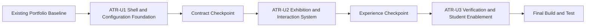

# Unit Dependencies - Artistic Template Presentation Redesign

## Dependency Flow

### Text Alternative

The existing portfolio baseline feeds ATR-U1. After the template and shell contract checkpoint passes, ATR-U2 implements the artistic exhibition and interactions. After the experience checkpoint passes, ATR-U3 completes integrated verification and student documentation. Final Build and Test runs after ATR-U3.

## Dependency Matrix

| Unit | Depends On | Provides To Later Units | May Start When | Blocks |
|---|---|---|---|---|
| ATR-U1 | Existing portfolio, approved application design | Shell contract, chapter labels, artistic config/resolver, App integration, engineering regression baseline | Units approved and Construction begins | ATR-U2 and ATR-U3 |
| ATR-U2 | ATR-U1 contract checkpoint | Complete artistic chapters, rails, motion, journal presentation, interaction tests | ATR-U1 exit gate passes | ATR-U3 |
| ATR-U3 | ATR-U1 and ATR-U2 exit gates | Integrated regression evidence, visual checks, student docs, final scoped fixes | ATR-U2 experience checkpoint passes | Final Build and Test |

## Update Sequence

### 1. ATR-U1 Foundation

1. Complete Functional Design for shell state, index focus/navigation, metadata fallbacks, and route integration.
2. Complete Unit 1 NFR Requirements and NFR Design.
3. Approve and execute the Unit 1 Code Generation plan.
4. Run focused tests, TypeScript, lint, and build.
5. Pass the Contract Checkpoint.

### 2. ATR-U2 Experience

1. Load the finalized ATR-U1 contracts and tests.
2. Complete Functional Design for rails, motion, chapter behavior, media preview, and article navigation.
3. Complete Unit 2 NFR Requirements and NFR Design.
4. Approve and execute the Unit 2 Code Generation plan.
5. Run focused and integrated checks.
6. Pass the Experience Checkpoint.

### 3. ATR-U3 Quality and Enablement

1. Load complete Unit 1 and Unit 2 code, tests, and design artifacts.
2. Skip separate Functional/NFR design unless new logic is explicitly approved.
3. Approve and execute the Unit 3 Code Generation plan for tests, docs, and scoped fixes.
4. Run all automated and visual verification.
5. Hand off to final Build and Test.

## Contract Checkpoint: ATR-U1 to ATR-U2

ATR-U2 may begin only when:

- `PortfolioTemplate` exposes Shell, journal view, chapter labels, and complete section map.
- `PortfolioShellProps` is stable and App passes all shared state/callbacks through it.
- EngineeringShell preserves existing Navbar and main-region behavior.
- ArtisticShell, Header, and VisualIndex render and navigate in both layout modes.
- Existing section and journal hashes remain valid.
- Artistic presentation resolver returns complete data for full, partial, absent, and unknown configuration.
- Stable project IDs are unique and validated.
- Unit 1 automated checks, TypeScript, lint, and build pass.

## Experience Checkpoint: ATR-U2 to ATR-U3

ATR-U3 may begin only when:

- Every existing route ID renders an artistic chapter containing its shared information.
- Selected Works and Visual Archive rails expose all items through native scrolling and controls.
- No vertical wheel hijacking is present.
- Reduced-motion behavior removes parallax and large transitions without hiding content.
- Artistic local journal detail and not-found states use shared routing correctly.
- Resume, project actions, external writing, certificates, social links, videos, and contact behavior remain available.
- Unit 2 automated checks, TypeScript, lint, and build pass.

## Shared Contract Ownership

| Contract | Owning Unit | Consumer |
|---|---|---|
| `PortfolioTemplate` and `PortfolioShellProps` | ATR-U1 | App, EngineeringShell, ArtisticShell, tests |
| Stable `ProjectEntry.id` | ATR-U1 | Artistic config, resolver, Selected Works, tests |
| Artistic chapter labels | ATR-U1 | Header, VisualIndex, ChapterFrame, tests |
| Resolved artistic presentation data | ATR-U1 | ATR-U2 chapter components |
| `ArtisticRail` and rail state | ATR-U2 | Selected Works, Visual Archive, ATR-U3 tests |
| Motion preference and reveal state | ATR-U2 | Artistic chapters, rails, ATR-U3 tests |
| Artistic journal component | ATR-U2 | App template rendering, ATR-U3 route tests |
| Integrated verification helpers | ATR-U3 | Final Build and Test |

## Change Coordination Rules

- ATR-U2 must not alter Unit 1 contracts without returning to the Unit 1 design and verification checkpoint.
- ATR-U2 may develop independent chapter components in parallel only after Unit 1 contracts are complete; integration remains sequential in the shared worktree.
- ATR-U3 may add test helpers and scoped defect fixes but does not own new product behavior.
- A discovered requirement gap returns to the relevant Inception artifact instead of being silently absorbed by a later unit.
- Existing user changes and unrelated dirty-worktree files are preserved throughout all units.

## Integration Test Boundaries

| Boundary | Verification |
|---|---|
| App to active Shell | Correct shell receives state, callbacks, layout mode, and rendered content |
| Shell to layout service | Navigation and layout controls delegate through App callbacks |
| Config to resolver | Missing and unknown metadata produces deterministic fallback output |
| Resolver to artistic chapters | Featured work, statements, treatments, and accents render without content duplication |
| Rail to chapter item renderers | All project/gallery items are reachable with correct semantics and actions |
| Motion preference to UI | Reduced-motion state removes nonessential movement while preserving controls |
| Journal route to template view | Shared slug parsing selects engineering or artistic post presentation correctly |
| Both templates to static build | Registry, routes, assets, and deployment base path remain compatible |

## Rollback Boundaries

- **ATR-U1**: Keep engineering template as registry fallback; isolate new shell fields behind complete template definitions.
- **ATR-U2**: Roll back individual artistic chapter mappings or rail/motion modules without changing shared data.
- **ATR-U3**: Revert only tests/docs or scoped integration fixes; do not remove verified Unit 1/2 contracts casually.

## Extension Rule Compliance

| Extension | Status | Rationale |
|---|---|---|
| Security Baseline | Disabled | Disabled during Requirements Analysis; no security extension constraints apply. |
| Property-Based Testing | Disabled | Disabled during Requirements Analysis; no PBT extension constraints apply. |
