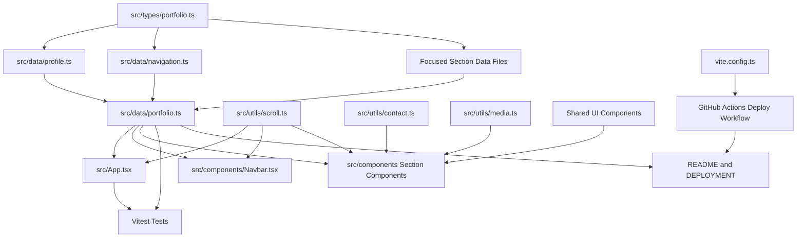

# Component Dependency

## Dependency Diagram

## Text Alternative

Shared types support all focused data modules. Focused data modules feed a portfolio aggregator. The app, navbar, and sections consume aggregated data and shared utilities. Tests validate the data and app render. Documentation references the data structure and deployment workflow. Vite config is consumed by the GitHub Actions workflow.

## Dependency Matrix

| Source | Depends On | Relationship | Change Type |
|---|---|---|---|
| `src/data/*` | `src/types/portfolio.ts` | Data modules conform to shared types | Major |
| `src/data/portfolio.ts` | Focused data files | Aggregates student-editable content | Major |
| `src/App.tsx` | `portfolio`, `useActiveSection` | Renders configured sections and active navigation | Major |
| `Navbar.tsx` | `navigationItems`, `scrollToSection` | Renders shared navigation source of truth | Major |
| Section components | Focused data, shared UI, utilities | Render template content | Major |
| `Contact.tsx` | `profile`, `buildMailtoUrl` | Builds contact behavior from configured email | Minor |
| `Videos.tsx` | `videos`, media URL utilities | Renders embeds and watch links | Minor |
| `Skills.tsx` | `skills`, `certificates` | Renders skill/certificate data | Major |
| Tests | App and data modules | Validate rendering and data/config integrity | Major |
| `vite.config.ts` | `VITE_BASE_PATH` | Reads deployment base path from env | Configuration |
| GitHub Actions | Repository metadata and Vite build | Passes deployment base path and deploys `dist/` | Configuration |
| Documentation | Data/config/workflow structure | Teaches setup and customization | Major |

## Communication Patterns

- **Static imports**: Components import data, utilities, and shared UI modules.
- **Props**: App passes active section state into `Navbar`; shared UI components receive typed props.
- **Browser APIs**: Shared scroll utility uses DOM section IDs; contact utility returns a mailto URL consumed by `Contact`.
- **Build-time environment**: GitHub Actions passes `VITE_BASE_PATH` to Vite.
- **Test assertions**: Tests import app/data modules and assert behavior without network calls.

## Coupling Guidelines

- Components should depend on typed data modules, not raw duplicated inline arrays.
- Section IDs should come from one navigation config.
- Utilities should not import section components.
- Data modules should not import UI components.
- Documentation should reflect actual scripts and file locations.
- Deployment workflow should not require students to edit application code for ordinary repository Pages deployment.

## Extension Rule Compliance

| Extension | Status | Rationale |
|---|---|---|
| Security Baseline | Disabled | User opted out during Requirements Analysis. |
| Property-Based Testing | Disabled | User opted out during Requirements Analysis. |
