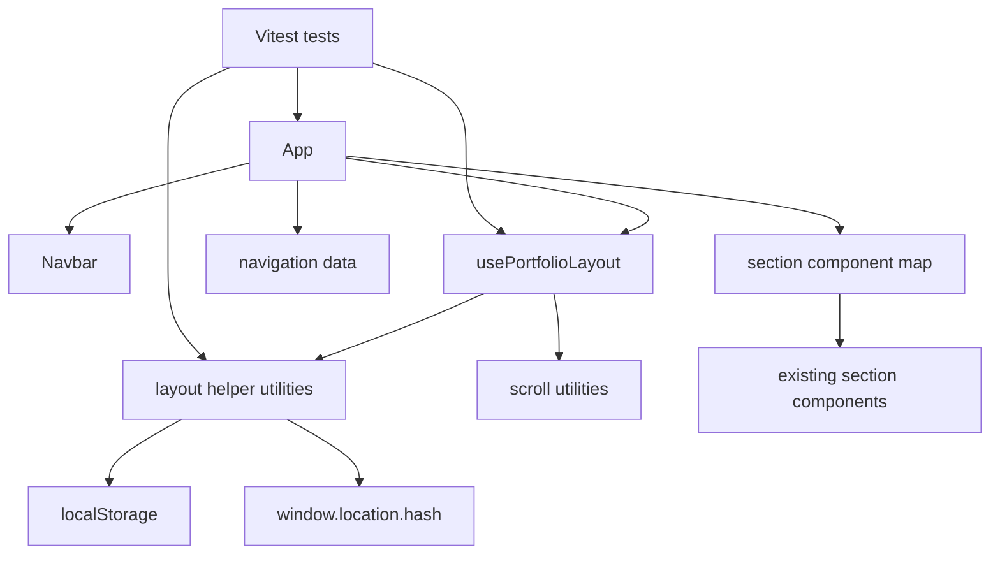

# Component Dependencies - Multi-Page Layout Switcher

## Dependency Diagram

### Text Alternative

`App` reads navigation data, uses `usePortfolioLayout`, renders `Navbar`, and renders sections through the existing section component map. `usePortfolioLayout` depends on layout helper utilities and the existing scroll utilities. Layout helper utilities read browser storage and hash state safely. Tests exercise the app, the layout controller, and helper utilities.

## Dependency Matrix

| Source | Depends On | Dependency Type | Direction |
|---|---|---|---|
| `App` | navigation data | Data | Existing |
| `App` | section component map | Render mapping | Existing |
| `App` | `useActiveSection` | Scroll state | Existing |
| `App` | `usePortfolioLayout` | Layout orchestration | New |
| `App` | `Navbar` | UI composition | Existing, expanded props |
| `Navbar` | parent callbacks | Event delegation | New |
| `usePortfolioLayout` | layout helper utilities | Pure helper calls | New |
| `usePortfolioLayout` | `scrollToSection` | Single-page navigation | Existing |
| layout helper utilities | `localStorage` | Optional browser storage | New |
| layout helper utilities | `window.location.hash` | Optional browser hash state | New |
| tests | app and helpers | Verification | Expanded |

## Communication Patterns

### App To Navbar

- `App` passes current `layoutMode`.
- `App` passes `activeSection`.
- `App` passes `onToggleLayoutMode`.
- `App` passes `onNavigate`.
- `App` passes `getNavigationHref`.
- `Navbar` remains a UI component and does not parse hashes or storage.

### Navbar To App

- User clicks layout switch control.
- `Navbar` calls `onToggleLayoutMode`.
- User clicks a navigation item.
- `Navbar` calls `onNavigate(sectionId)`.
- `Navbar` closes its drawer after mobile interactions.

### App To Sections

- Single-page mode maps over all enabled section IDs.
- Multi-page mode renders the active page section only.
- Section components do not receive layout mode props in the initial design.

### Layout Controller To Browser APIs

- Layout mode persistence uses localStorage through safe helper functions.
- Multi-page navigation uses `window.location.hash`.
- Browser back and forward behavior is handled by listening for hash changes.

## Coupling Guidelines

- Keep `SectionId` as the shared contract between navigation, layout state, and rendering.
- Keep hash parsing out of `Navbar`.
- Keep localStorage parsing out of `App`.
- Keep section components unaware of routing and layout mode.
- Keep tests focused on behavior rather than visual pixels.

## Content Validation

| Check | Result |
|---|---|
| Mermaid diagram | Validated with simple alphanumeric node IDs and direct edges. |
| Text alternative | Included. |
| ASCII diagrams | Not applicable. |
| Markdown tables | Valid simple pipe tables. |
| Code fences | Mermaid fence closed properly. |
