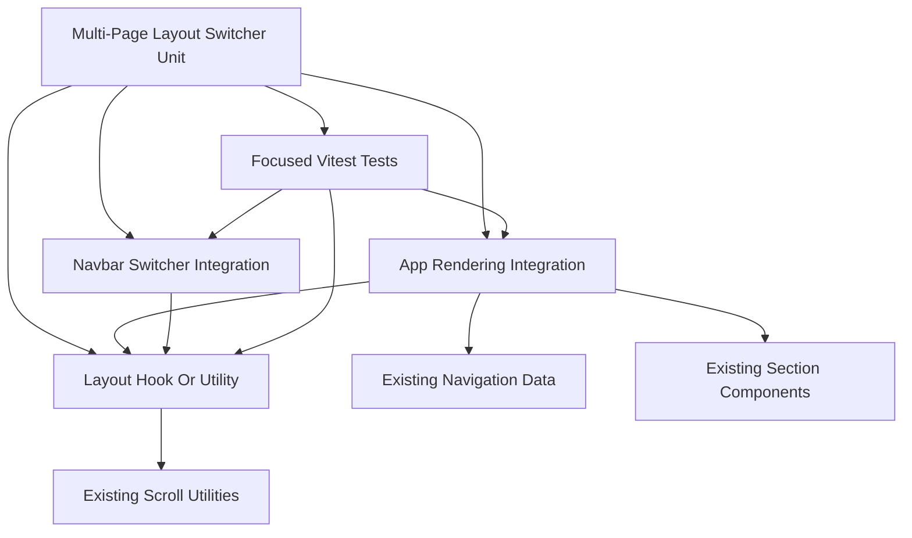

# Unit Of Work Dependencies - Multi-Page Layout Switcher

## Unit Dependency Diagram

### Text Alternative

The single unit contains app rendering integration, navbar switcher integration, layout state utilities, and tests. `App` depends on existing navigation data and existing section components. The layout state utility depends on existing scroll utilities for single-page behavior. Tests cover `App`, `Navbar`, and layout state behavior.

## Dependency Matrix

| Dependency | Direction | Required For | Risk |
|---|---|---|---|
| Existing navigation data | `App` reads it | Enabled section/page list | Low |
| Existing section component map | `App` uses it | Rendering all sections or active section | Low |
| Existing scroll utilities | Layout state uses `scrollToSection`; `App` uses `useActiveSection` | Preserve single-page mode | Medium |
| Browser hash state | Layout utility reads and writes it | Multi-page page selection | Medium |
| Browser localStorage | Layout utility reads and writes it | Mode persistence | Low |
| `Navbar` callbacks | `Navbar` receives from `App` | Mode switching and mode-aware navigation | Medium |
| Vitest setup | Tests use existing test stack | Local verification | Low |

## Sequencing

1. Define the layout mode helper or hook.
2. Wire the hook into `App`.
3. Update `Navbar` props and switch controls.
4. Add rendering and navigation tests.
5. Run lint, build, and tests.

## Coordination Points

| Coordination Point | Guidance |
|---|---|
| Section IDs | Keep `SectionId` as the shared contract across navigation, hash parsing, and rendering. |
| Hash formats | Use `#section` for single-page anchors and `#/section` for multi-page pages. |
| Active state | Single-page mode uses scroll-active section; multi-page mode uses hash-active section. |
| Storage | Persist only the layout mode value. |
| Tests | Prefer behavior assertions over visual pixel assertions. |

## Dependency Risks And Mitigations

| Risk | Mitigation |
|---|---|
| Hash updates conflict with single-page anchors | Keep separate href generation by layout mode. |
| Navbar becomes coupled to storage/hash details | Pass callbacks and href generator from `App`. |
| Disabled navigation items become routable | Parse hashes only against enabled section IDs. |
| Storage is unavailable | Catch read/write errors and default safely. |
| Student edits create duplicate section definitions | Keep section/page mapping based on existing navigation and section component map. |

## Content Validation

| Check | Result |
|---|---|
| Mermaid diagram | Validated with simple alphanumeric node IDs and direct edges. |
| Text alternative | Included. |
| ASCII diagrams | Not applicable. |
| Markdown tables | Valid simple pipe tables. |
| Code fences | Mermaid fence closed properly. |
