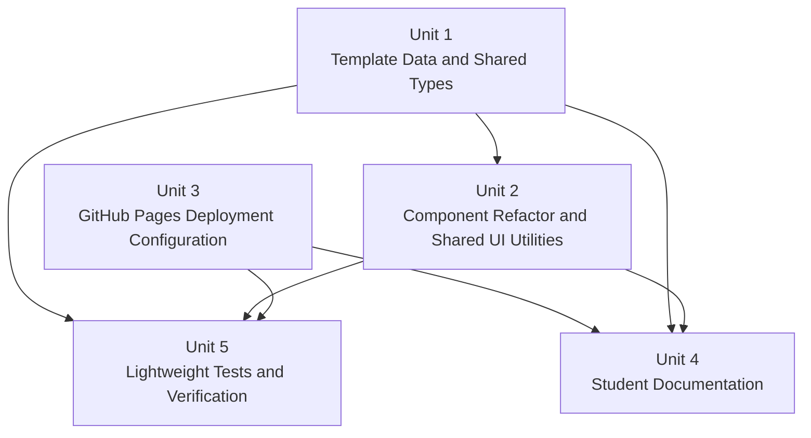

# Unit Of Work Dependency

## Dependency Diagram

## Text Alternative

Data and shared types should be completed first because components, docs, and tests depend on the new editing surface. Component refactor follows the data model. Deployment configuration can happen after or alongside component refactor, but documentation and tests depend on its final behavior. Tests validate the completed data, component, and deployment setup.

## Dependency Matrix

| Unit | Depends On | Blocks | Dependency Reason |
|---|---|---|---|
| Unit 1: Template Data And Shared Types | None | Unit 2, Unit 4, Unit 5 | Defines the content model and section source of truth. |
| Unit 2: Component Refactor And Shared UI Utilities | Unit 1 | Unit 4, Unit 5 | Components need finalized data shapes; docs/tests should reflect refactored structure. |
| Unit 3: GitHub Pages Deployment Configuration | None, but safest after Unit 1 | Unit 4, Unit 5 | Docs and tests/verification need final base path behavior. |
| Unit 4: Student Documentation | Unit 1, Unit 2, Unit 3 | None | Documentation must match actual code and workflow behavior. |
| Unit 5: Lightweight Tests And Verification | Unit 1, Unit 2, Unit 3 | Build and Test stage | Tests validate final data/config/component/deployment assumptions. |

## Sequencing Rules

- Complete Unit 1 before major component refactoring.
- Complete Unit 2 before final documentation screenshots/examples and smoke render tests.
- Complete Unit 3 before final deployment guide wording.
- Complete Unit 5 after the tested surfaces exist.
- Documentation can be drafted earlier, but final documentation should be updated after code and workflow behavior settle.

## Coordination Points

- **Navigation IDs**: Unit 1 defines them; Unit 2 consumes them; Unit 5 validates them; Unit 4 documents them.
- **Asset imports**: Unit 1 preserves Vite-compatible imports; Unit 2 renders them; Unit 4 teaches replacement; Unit 5 verifies key data.
- **Base path behavior**: Unit 3 implements; Unit 4 explains; Unit 5 verifies build behavior where practical.
- **Scripts**: Unit 5 adds test command; Unit 4 documents all commands.

## Ownership Guidance

- Units are contributor-friendly and can be assigned by expertise.
- One maintainer can still execute all units sequentially.
- Multiple contributors should coordinate through Unit 1's data model and Unit 3's deployment decisions.

## Extension Rule Compliance

| Extension | Status | Rationale |
|---|---|---|
| Security Baseline | Disabled | User opted out during Requirements Analysis. |
| Property-Based Testing | Disabled | User opted out during Requirements Analysis. |
