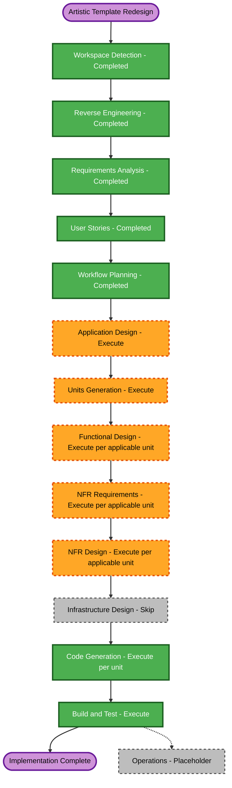

# Execution Plan - Artistic Template Presentation Redesign

> **Status: Superseded on 2026-07-19.** The complex exhibition redesign is closed. The active minimal plan is `aidlc-docs/inception/plans/three-template-simplification-execution-plan.md`.

## Detailed Analysis Summary

### Transformation Scope

- **Transformation Type**: Brownfield application presentation architecture and interaction redesign.
- **Primary Changes**: Expand the template contract beyond section substitution; add an artistic shell and navigation; add optional presentation metadata with fallbacks; implement accessible horizontal rails and motion behavior; reorganize shared content into artistic chapters; preserve layout modes, journal routing, engineering behavior, and static deployment.
- **Related Components**: `App`, template types and registry, artistic template definition, layout hook, navigation, artistic components, shared data types, CSS, tests, README, and AI-DLC verification artifacts.
- **Infrastructure Impact**: None. The existing GitHub Pages deployment remains unchanged.

### Change Impact Assessment

| Impact Area | Assessment |
|---|---|
| User-facing changes | High. The artistic navigation, information architecture, galleries, motion, and chapter composition all change. |
| Structural changes | High. The template contract must support a template-specific shell and navigation. |
| Data model changes | Moderate. Optional artistic metadata and deterministic fallbacks are required without breaking existing data. |
| API changes | Internal only. Template and component contracts change; no external API is introduced. |
| NFR impact | High. Keyboard access, focus management, reduced motion, responsive overflow, media loading, visual stability, and bundle behavior require design and verification. |
| Deployment changes | None. The result remains a static Vite build for GitHub Pages. |

### Component Relationships

- **Primary Component**: `src/templates/` - template contracts, registry, engineering definition, and artistic definition.
- **Application Orchestrator**: `src/App.tsx` - active template shell, layout mode, section visibility, and journal route composition.
- **Shared State and Routing**: `src/hooks/usePortfolioLayout.ts`, `src/utils/scroll.ts`, and `src/utils/journal.ts`.
- **Presentation Components**: Artistic header/index, horizontal rail, chapter sections, journal reading treatment, and closing contact composition.
- **Shared Models**: `src/types/portfolio.ts` and `src/data/` configuration files.
- **Quality Consumers**: Registry tests, App integration tests, interaction tests, responsive visual checks, lint, TypeScript, and build.
- **Unaffected Boundary**: GitHub Pages workflow and backend infrastructure because no server resources exist.

### Risk Assessment

- **Risk Level**: High for user-experience and accessibility regression; low for stored data because the app is static and has no database.
- **Rollback Complexity**: Moderate. The engineering template provides a working fallback, but the artistic shell contract will touch App orchestration.
- **Testing Complexity**: Complex. Verification spans focus, keyboard, touch-oriented overflow, reduced motion, two layout modes, direct hashes, two color modes, and desktop/mobile composition.
- **Primary Risks**:
  - Artistic shell behavior leaks into engineering.
  - Horizontal content becomes unreachable or visually clipped.
  - Full-screen index loses or traps focus incorrectly.
  - Motion causes discomfort or hides content.
  - Grouped artistic chapters omit existing portfolio information.
  - Multi-page or local journal hashes regress.

## Recommended Unit Sequence

### Unit 1: Template Shell and Configuration Foundation

- Expand typed template contracts to support template-specific shell/navigation behavior.
- Define optional artistic presentation metadata and fallback resolution.
- Integrate artistic shell selection into App without changing engineering behavior.
- Implement the compact artistic header and accessible full-screen visual index.
- Preserve layout controls, active chapter state, and direct hash behavior.

### Unit 2: Artistic Exhibition and Interaction System

- Create reusable horizontal rail and motion-preference primitives.
- Build the Opening Statement, Formation, Practice, Selected Works, Visual Archive, Process Notes, Materials and Capabilities, and Closing Contact compositions.
- Apply artistic reading treatment to local journal post and not-found states.
- Preserve project actions, resume, certificates, external links, and contact behavior.

### Unit 3: Verification and Student Enablement

- Add template contract, shell, index, rail, routing, fallback, and reduced-motion tests.
- Verify engineering regression and both artistic layout modes.
- Perform desktop/mobile and light/dark visual checks for overlap, clipping, blank media, and horizontal reachability.
- Update student documentation for artistic metadata, image selection, layout modes, and verification.

## Module Update Strategy

- **Update Approach**: Sequential foundation followed by partially parallel presentation work, then integrated verification.
- **Critical Path**: Template contracts and App shell integration must complete before artistic chapter components can be wired into the application.
- **Parallelization Opportunities**: Once Unit 1 contracts are stable, independent artistic chapter components can be developed in parallel conceptually, while preserving one code-generation sequence in this workspace.
- **Coordination Points**: `SectionId`, navigation items, layout hashes, template shell props, optional metadata fallbacks, CSS variable scope, and shared action behavior.
- **Testing Checkpoints**:
  1. Contract and engineering regression checks after Unit 1.
  2. Interaction and content-completeness checks after Unit 2.
  3. Full automated and visual verification in Unit 3 and Build/Test.
- **Rollback Strategy**: Keep the engineering template resolvable throughout; isolate artistic files and CSS; revert individual artistic mappings rather than shared data if a presentation unit fails.

## Workflow Visualization

### Text Alternative

Workspace Detection, Reverse Engineering, Requirements Analysis, User Stories, and Workflow Planning are complete. Application Design and Units Generation execute next. Functional Design, NFR Requirements, and NFR Design execute for applicable units. Infrastructure Design is skipped. Code Generation executes per unit, followed by Build and Test. Operations remains a placeholder.

## Stage Decisions

### Inception Phase

- [x] **Workspace Detection - Completed**: Confirmed a brownfield React/Vite static portfolio.
- [x] **Reverse Engineering - Completed**: Refreshed stale architecture and identified the current template boundary.
- [x] **Requirements Analysis - Completed**: Defined 28 functional and 20 non-functional requirements.
- [x] **User Stories - Completed**: Defined four personas and thirteen INVEST-aligned stories.
- [x] **Workflow Planning - Completed**: Defined the execution sequence and stage decisions.
- [ ] **Application Design - Execute, comprehensive depth**: New shell, navigation, rail, motion, metadata, and composition component boundaries require explicit interfaces and dependencies.
- [ ] **Units Generation - Execute, standard depth**: The work benefits from decomposition into foundation, exhibition, and verification units with dependency order.

### Construction Phase

- [ ] **Functional Design - Execute for applicable units**: Focus/index behavior, rail controls, metadata fallback, chapter mapping, and routing contain stateful rules requiring detailed design.
- [ ] **NFR Requirements - Execute for applicable units**: Accessibility, reduced motion, responsive overflow, performance, and visual stability require explicit per-unit constraints.
- [ ] **NFR Design - Execute for applicable units**: Components need concrete focus, motion, responsive, and media-loading patterns.
- [x] **Infrastructure Design - Skip**: No cloud resources, deployment model, networking, storage, or server runtime changes are required.
- [ ] **Code Generation - Execute per unit**: Each unit requires an approved implementation plan, application code, tests, and documentation updates.
- [ ] **Build and Test - Execute**: Run automated verification and perform responsive visual checks after all units integrate.

### Operations Phase

- [ ] **Operations - Placeholder**: No deployment execution or monitoring changes are part of the current AI-DLC operations placeholder.

## Application Design Focus

- Extend `PortfolioTemplate` with a typed shell or navigation composition boundary.
- Define shell inputs without coupling the template registry to App internals.
- Define artistic metadata, resolver responsibilities, and fallback rules.
- Define reusable horizontal rail and motion-preference interfaces.
- Define how existing section IDs map into artistic chapter labels while preserving hashes.
- Define artistic local-journal presentation without duplicating route logic.

## Per-Unit Design Expectations

| Unit | Functional Design | NFR Requirements and Design | Infrastructure Design |
|---|---|---|---|
| Unit 1 - Shell and Configuration | Execute | Execute | Skip |
| Unit 2 - Exhibition and Interaction | Execute | Execute | Skip |
| Unit 3 - Verification and Enablement | Skip unless new shared logic emerges | Skip; verifies approved NFRs from Units 1 and 2 | Skip |

## Scope Estimate

- **Remaining Lifecycle Stages**: Seven stage types before the Operations placeholder.
- **Units of Work**: Three sequentially coordinated units.
- **Relative Effort**: Large frontend redesign with complex interaction and visual verification.
- **Calendar Estimate**: Not assigned by AI-DLC; progress is controlled through the documented approval gates and per-unit checklists.

## Success Criteria

- **Primary Goal**: The artistic template is structurally, behaviorally, and visually distinct while presenting the same portfolio information.
- **Architecture**: Template-specific shell and navigation are expressed through typed boundaries; engineering remains unchanged.
- **Experience**: Editorial chapters, native horizontal rails, visual index, and moderate motion work across responsive viewports.
- **Accessibility**: Keyboard, focus, touch, contrast, and reduced-motion behavior satisfy approved requirements.
- **Compatibility**: Both layout modes, direct hashes, local journal routes, resume, certificates, links, and mailto behavior work.
- **Quality Gates**: Tests, TypeScript, lint, production build, desktop/mobile screenshots, and overlap/media checks pass.
- **Documentation**: Students can select and customize the artistic template without duplicating content.

## Extension Rule Compliance

| Extension | Status | Rationale |
|---|---|---|
| Security Baseline | Disabled | Disabled during Requirements Analysis; skipped during Workflow Planning. |
| Property-Based Testing | Disabled | Disabled during Requirements Analysis; skipped during Workflow Planning. |
