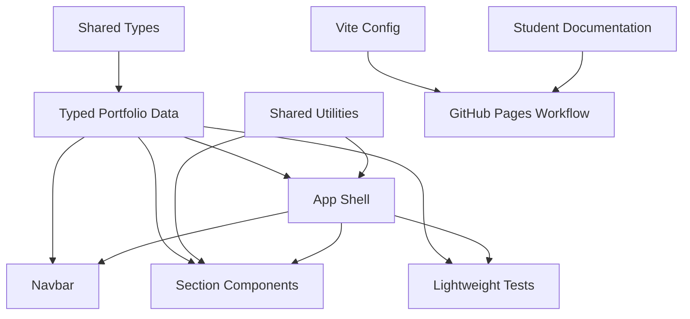

# Execution Plan

## Detailed Analysis Summary

### Transformation Scope

- **Transformation Type**: Brownfield application structure refactor with documentation, test, and deployment configuration enhancements.
- **Primary Changes**:
  - Extract student-editable portfolio content into typed data/config modules.
  - Centralize section/navigation configuration.
  - Add shared scroll utilities and selected reusable UI helpers.
  - Improve accessible labels for interactive links and controls.
  - Improve GitHub Pages base path handling through workflow/build configuration.
  - Rewrite student-facing README and deployment/customization guide.
  - Add lightweight tests for rendering, navigation config, and template data.
- **Related Components**:
  - `src/App.tsx`
  - `src/components/*`
  - `src/assets/*`
  - New `src/data/*`, `src/types/*`, and `src/utils/*`
  - `vite.config.ts`
  - `.github/workflows/deploy.yml`
  - `package.json`
  - README and deployment documentation

### Change Impact Assessment

- **User-facing changes**: Yes. The deployed portfolio should preserve the current visual experience while improving accessibility labels and deployment reliability.
- **Structural changes**: Yes. Editable content moves from components into typed data modules, shared section config becomes the navigation source of truth, and repeated helpers are centralized.
- **Data model changes**: Yes. New TypeScript data models are needed for portfolio content and navigation config.
- **API changes**: No external API changes. Internal component/data contracts will change.
- **NFR impact**: Yes. Maintainability, beginner readability, testability, accessibility, and deployment reliability are core requirements.

### Component Relationships

### Text Alternative

Shared types define portfolio data. Data feeds the app, navbar, and section components. Shared utilities support app and section behavior. Tests validate data and rendering. Vite configuration feeds the GitHub Pages deployment workflow, and documentation explains the student setup path.

### Risk Assessment

- **Risk Level**: Medium.
- **Rollback Complexity**: Moderate. Changes touch many components, but the app is static and can be rolled back through Git.
- **Testing Complexity**: Moderate. Build, lint, and lightweight tests should catch most template regressions.
- **Primary Risks**:
  - Accidentally changing the current visual output while refactoring data.
  - Introducing incorrect asset imports while moving data.
  - Misconfiguring GitHub Pages base path behavior.
  - Adding test dependencies that conflict with the current React/Vite stack.

## Module Update Strategy

- **Update Approach**: Hybrid sequential.
- **Critical Path**:
  1. Define shared types and data/config modules.
  2. Refactor components to consume data/config and shared utilities.
  3. Update deployment base path handling.
  4. Update documentation.
  5. Add tests and verification scripts.
  6. Run build, lint, and tests.
- **Coordination Points**:
  - Navigation IDs must stay aligned between data, app shell, navbar, tests, and documentation.
  - Asset imports must remain Vite-compatible.
  - GitHub Pages workflow must pass the correct base path to Vite.
- **Testing Checkpoints**:
  - TypeScript build after data extraction.
  - Lint after component refactor.
  - Test run after adding test setup.
  - Production build after deployment config changes.

## Workflow Visualization

```mermaid
flowchart TD
    Start(["User Request"])

    subgraph INCEPTION["INCEPTION PHASE"]
        WD["Workspace Detection<br/><b>COMPLETED</b>"]
        RE["Reverse Engineering<br/><b>COMPLETED</b>"]
        RA["Requirements Analysis<br/><b>COMPLETED</b>"]
        US["User Stories<br/><b>COMPLETED</b>"]
        WP["Workflow Planning<br/><b>COMPLETED</b>"]
        AD["Application Design<br/><b>EXECUTE</b>"]
        UG["Units Generation<br/><b>EXECUTE</b>"]
    end

    subgraph CONSTRUCTION["CONSTRUCTION PHASE"]
        FD["Functional Design<br/><b>EXECUTE</b>"]
        NFRA["NFR Requirements<br/><b>EXECUTE</b>"]
        NFRD["NFR Design<br/><b>EXECUTE</b>"]
        ID["Infrastructure Design<br/><b>EXECUTE</b>"]
        CG["Code Generation<br/>(Planning + Generation)<br/><b>EXECUTE</b>"]
        BT["Build and Test<br/><b>EXECUTE</b>"]
    end

    subgraph OPERATIONS["OPERATIONS PHASE"]
        OPS["Operations<br/><b>PLACEHOLDER</b>"]
    end

    Start --> WD
    WD --> RE
    RE --> RA
    RA --> US
    US --> WP
    WP --> AD
    AD --> UG
    UG --> FD
    FD --> NFRA
    NFRA --> NFRD
    NFRD --> ID
    ID --> CG
    CG --> BT
    BT --> End(["Complete"])

    style WD fill:#4CAF50,stroke:#1B5E20,stroke-width:3px,color:#fff
    style RE fill:#4CAF50,stroke:#1B5E20,stroke-width:3px,color:#fff
    style RA fill:#4CAF50,stroke:#1B5E20,stroke-width:3px,color:#fff
    style US fill:#4CAF50,stroke:#1B5E20,stroke-width:3px,color:#fff
    style WP fill:#4CAF50,stroke:#1B5E20,stroke-width:3px,color:#fff
    style AD fill:#FFA726,stroke:#E65100,stroke-width:3px,stroke-dasharray: 5 5,color:#000
    style UG fill:#FFA726,stroke:#E65100,stroke-width:3px,stroke-dasharray: 5 5,color:#000
    style FD fill:#FFA726,stroke:#E65100,stroke-width:3px,stroke-dasharray: 5 5,color:#000
    style NFRA fill:#FFA726,stroke:#E65100,stroke-width:3px,stroke-dasharray: 5 5,color:#000
    style NFRD fill:#FFA726,stroke:#E65100,stroke-width:3px,stroke-dasharray: 5 5,color:#000
    style ID fill:#FFA726,stroke:#E65100,stroke-width:3px,stroke-dasharray: 5 5,color:#000
    style CG fill:#FFA726,stroke:#E65100,stroke-width:3px,stroke-dasharray: 5 5,color:#000
    style BT fill:#FFA726,stroke:#E65100,stroke-width:3px,stroke-dasharray: 5 5,color:#000
    style OPS fill:#BDBDBD,stroke:#424242,stroke-width:2px,stroke-dasharray: 5 5,color:#000
    style Start fill:#CE93D8,stroke:#6A1B9A,stroke-width:3px,color:#000
    style End fill:#CE93D8,stroke:#6A1B9A,stroke-width:3px,color:#000
    style INCEPTION fill:#BBDEFB,stroke:#1565C0,stroke-width:3px,color:#000
    style CONSTRUCTION fill:#C8E6C9,stroke:#2E7D32,stroke-width:3px,color:#000
    style OPERATIONS fill:#FFF59D,stroke:#F57F17,stroke-width:3px,color:#000

    linkStyle default stroke:#333,stroke-width:2px
```

### Text Alternative

Completed stages: Workspace Detection, Reverse Engineering, Requirements Analysis, User Stories, Workflow Planning. Next stages to execute: Application Design, Units Generation, Functional Design, NFR Requirements, NFR Design, Infrastructure Design, Code Generation, Build and Test. Operations remains a placeholder.

## Phases to Execute

### INCEPTION PHASE

- [x] Workspace Detection - COMPLETED
- [x] Reverse Engineering - COMPLETED
- [x] Requirements Analysis - COMPLETED
- [x] User Stories - COMPLETED
- [x] Workflow Planning - COMPLETED
- [ ] Application Design - EXECUTE
  - **Rationale**: New data modules, shared types, reusable helpers, component responsibilities, and deployment configuration boundaries need a lightweight design before implementation.
- [ ] Units Generation - EXECUTE
  - **Rationale**: Work should be decomposed into coordinated units for data extraction, component refactor, documentation, deployment config, and tests.

### CONSTRUCTION PHASE

- [ ] Functional Design - EXECUTE
  - **Rationale**: New typed data models and shared utilities need functional design at unit level.
- [ ] NFR Requirements - EXECUTE
  - **Rationale**: Maintainability, beginner readability, accessibility, testability, and deployment reliability are explicit NFRs.
- [ ] NFR Design - EXECUTE
  - **Rationale**: NFRs must be incorporated into code organization, tests, documentation, and deployment behavior.
- [ ] Infrastructure Design - EXECUTE
  - **Rationale**: GitHub Pages and GitHub Actions deployment path handling should be designed before editing workflow/build configuration.
- [ ] Code Generation - EXECUTE
  - **Rationale**: Implementation planning and code generation are needed for the approved refactor.
- [ ] Build and Test - EXECUTE
  - **Rationale**: Build, lint, test, and deployment verification instructions are required.

### OPERATIONS PHASE

- [ ] Operations - PLACEHOLDER
  - **Rationale**: Future deployment and monitoring workflows are outside the current AI-DLC process.

## Skipped Stages

- No current INCEPTION or CONSTRUCTION stage is recommended for skip because the approved scope is comprehensive and touches application structure, data models, NFRs, deployment configuration, documentation, and tests.

## Package Change Sequence

1. `src/types/*` - Add shared portfolio data types first.
2. `src/data/*` - Move editable example content into typed data/config modules.
3. `src/utils/*` - Add shared scroll/navigation utilities.
4. `src/components/*` and `src/App.tsx` - Refactor UI to consume data/config and utilities.
5. `vite.config.ts` and `.github/workflows/deploy.yml` - Improve GitHub Pages base path handling.
6. `package.json` and test files - Add lightweight test setup and scripts.
7. `README.md` and `DEPLOYMENT.md` - Rewrite student-facing setup and deployment guidance.
8. `aidlc-docs/construction/build-and-test/*` - Generate build/test instruction artifacts.

## Estimated Timeline

- **Total Remaining Stages**: 8 before Operations placeholder.
- **Estimated Duration**: Medium. The work is not algorithmically complex, but it affects many files and needs careful verification.

## Success Criteria

- **Primary Goal**: The portfolio becomes a maintainable student baseline template with clear content customization, GitHub Pages deployment guidance, and lightweight tests.
- **Key Deliverables**:
  - Typed portfolio data/config modules.
  - Refactored components consuming shared data and utilities.
  - Improved accessible labels.
  - GitHub Pages base path workflow improvements.
  - Beginner-friendly README and detailed deployment/customization guide.
  - Lightweight test setup and passing test command.
  - AI-DLC build and test instructions.
- **Quality Gates**:
  - `npm run lint` passes.
  - `npm run test` passes after test setup is added.
  - `npm run build` passes.
  - Student documentation explains local setup, customization, deployment, and troubleshooting.
  - Current visual/content experience is preserved as example data.

## Extension Rule Compliance

| Extension | Status | Rationale |
|---|---|---|
| Security Baseline | Disabled | User opted out during Requirements Analysis. |
| Property-Based Testing | Disabled | User opted out during Requirements Analysis. |
