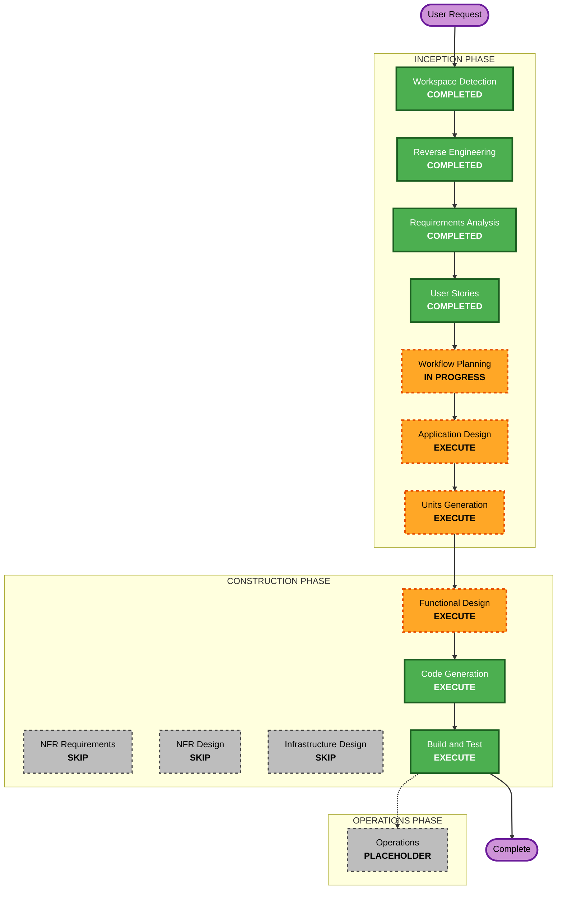

# Execution Plan - Journal Inline Posts

## Detailed Analysis Summary

### Transformation Scope

- **Transformation Type**: Brownfield application enhancement.
- **Primary Changes**: Add local Markdown-backed Journal posts, merge local and WordPress writing cards, add source badges, and add GitHub Pages-compatible in-site post reading pages.
- **Related Components**: `src/data/blog.ts`, `src/types/portfolio.ts`, `src/components/Journal.tsx`, `src/App.tsx`, shared navigation/hash behavior, tests, and new local post content files.

### Change Impact Assessment

- **User-facing changes**: Yes. Visitors will see local posts in Journal and can open full in-site article pages.
- **Structural changes**: Yes. Journal writing data must support local and external post types.
- **Data model changes**: Yes. Existing `BlogEntry` needs to evolve into a source-aware writing entry model.
- **API changes**: No external API changes. Internal TypeScript interfaces will change.
- **NFR impact**: Yes. Static hosting compatibility and no-runtime-backend constraints must be preserved.

### Component Relationships

- **Primary Component**: Journal section.
- **Shared Components**: `ExternalAction`, `ContentCard`, `SectionShell`, app-level hash routing.
- **Data Components**: Blog metadata, local post metadata/content, portfolio aggregate exports.
- **Test Components**: Portfolio data tests and app smoke/navigation tests.
- **Infrastructure Components**: None. GitHub Pages deployment remains unchanged.

### Risk Assessment

- **Risk Level**: Medium.
- **Rollback Complexity**: Easy to moderate; changes are contained to frontend data, rendering, and tests.
- **Testing Complexity**: Moderate; must cover static metadata, local post rendering, external post preservation, and direct hash navigation.

## Module Update Strategy

- **Update Approach**: Sequential single-package update.
- **Critical Path**: Types and content model first, then data/content, then UI/routing, then tests.
- **Coordination Points**: Existing Journal rendering, `sectionIds`/hash navigation, WordPress post compatibility.
- **Testing Checkpoints**: Data tests after model changes, app tests after routing/read-page behavior, full build after all code generation.

## Workflow Visualization

### Text Alternative

Workspace Detection, Reverse Engineering, Requirements Analysis, and User Stories are complete. Workflow Planning is in progress. The next inception stages are Application Design and Units Generation. Construction will execute Functional Design, Code Generation, and Build and Test. NFR Requirements, NFR Design, and Infrastructure Design will be skipped because the existing static-site architecture remains sufficient and no infrastructure change is required.

## Phases to Execute

### INCEPTION PHASE

- [x] Workspace Detection - COMPLETED
- [x] Reverse Engineering - COMPLETED
- [x] Requirements Analysis - COMPLETED
- [x] User Stories - COMPLETED
- [x] Workflow Planning - IN PROGRESS
- [ ] Application Design - EXECUTE
  - **Rationale**: New content model, local reading view, and hash-compatible post navigation need component-level design.
- [ ] Units Generation - EXECUTE
  - **Rationale**: The enhancement can be decomposed into one unit with clear target files and test scope.

### CONSTRUCTION PHASE

- [ ] Functional Design - EXECUTE
  - **Rationale**: Markdown post metadata, source-aware writing entries, and post lookup behavior need focused design.
- [ ] NFR Requirements - SKIP
  - **Rationale**: NFRs are already explicit in requirements; no new technology stack selection is needed.
- [ ] NFR Design - SKIP
  - **Rationale**: No new NFR patterns are required beyond preserving static build behavior.
- [ ] Infrastructure Design - SKIP
  - **Rationale**: GitHub Pages static deployment remains unchanged.
- [ ] Code Generation - EXECUTE
  - **Rationale**: Implementation planning and code changes are required.
- [ ] Build and Test - EXECUTE
  - **Rationale**: Tests, lint, and production build must verify the enhancement.

### OPERATIONS PHASE

- [ ] Operations - PLACEHOLDER
  - **Rationale**: No deployment or monitoring workflow expansion is needed.

## Proposed Unit of Work

### Unit 1: Journal Inline Posts

- **Scope**: Local Markdown post content, source-aware Journal writing list, in-site reading page, GitHub Pages-compatible hash navigation, and tests.
- **Primary Files**:
  - `src/types/portfolio.ts`
  - `src/data/blog.ts`
  - `src/data/portfolio.ts`
  - `src/components/Journal.tsx`
  - `src/App.tsx`
  - `src/data/portfolio.test.ts`
  - `src/App.test.tsx`
  - New local journal post content files
- **Dependencies**: Existing Chakra UI, React, Vite, hash navigation, and static asset handling.

## Success Criteria

- Local Markdown posts can be added to the repository and displayed in Journal.
- Local and WordPress posts render in one writing list with source badges.
- Local posts open in an in-site reading view using GitHub Pages-compatible hash URLs.
- Existing WordPress links and videos continue to work.
- The site remains fully static with no backend, database, authentication, or runtime content API.
- `npm run test`, `npm run lint`, and `npm run build` pass.

## Extension Compliance

| Extension | Status | Rationale |
|---|---|---|
| Security Baseline | Skipped | Disabled in `aidlc-docs/aidlc-state.md`. |
| Property-Based Testing | Skipped | Disabled in `aidlc-docs/aidlc-state.md`. |
