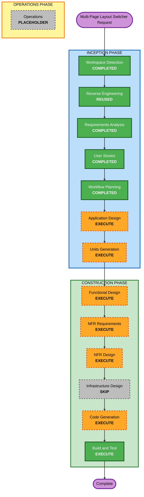

# Execution Plan - Multi-Page Layout Switcher

## Detailed Analysis Summary

### Transformation Scope

- **Transformation Type**: Single application feature within the existing React portfolio.
- **Primary Changes**: Add a navbar layout switcher, layout mode state, GitHub Pages-safe hash page navigation, and conditional section rendering.
- **Related Components**: `src/App.tsx`, `src/components/Navbar.tsx`, `src/data/navigation.ts`, `src/utils/scroll.ts`, a new layout mode hook or utility, and focused Vitest tests.

### Change Impact Assessment

| Impact Area | Assessment |
|---|---|
| User-facing changes | Yes. Visitors and students can switch between single-page and multi-page browsing. |
| Structural changes | Yes. The app needs a small layout mode state layer and conditional section rendering. |
| Data model changes | Minimal. Existing `SectionId` and navigation data remain the section/page source of truth. |
| API changes | No backend or external API changes. Component props will likely expand for navigation behavior. |
| NFR impact | Yes. GitHub Pages compatibility, accessibility, maintainability, and lightweight performance must be preserved. |

### Component Relationships

| Component | Change Type | Change Reason | Priority |
|---|---|---|---|
| `src/App.tsx` | Major feature change | Orchestrates single-page vs multi-page rendering and active section/page state. | Critical |
| `src/components/Navbar.tsx` | Major feature change | Hosts the desktop/mobile switcher and mode-aware navigation links. | Critical |
| New layout mode hook or utility | New component | Isolates mode persistence and hash page behavior for maintainability. | Critical |
| `src/data/navigation.ts` | Minor | Remains source of enabled section/page definitions. May need helper alignment only. | Important |
| `src/utils/scroll.ts` | Minor | Keeps single-page smooth-scroll behavior separate from multi-page hash navigation. | Important |
| Vitest test files | Major test addition | Verifies switching, page rendering, hash behavior, and safe fallback cases. | Critical |
| GitHub Pages workflow | No change expected | Hash URLs avoid server-side route fallback requirements. | Optional |

### Risk Assessment

- **Risk Level**: Medium
- **Rollback Complexity**: Easy to moderate. The feature can be reverted to current single-page rendering if the switcher causes issues.
- **Testing Complexity**: Moderate. Tests must cover browser hash behavior and localStorage behavior in JSDOM without becoming brittle.
- **Primary Risks**:
  - Breaking the current single-page navigation behavior.
  - Creating confusing hash behavior between `#section` and `#/section`.
  - Making the navbar too crowded on smaller screens.
  - Introducing duplicated section mappings that students later forget to update.

## Workflow Visualization

### Text Alternative

1. Workspace Detection: completed for the existing brownfield portfolio.
2. Reverse Engineering: reused previous brownfield artifacts.
3. Requirements Analysis: completed for the multi-page layout switcher.
4. User Stories: completed for visitors, student customizers, and template maintainers.
5. Workflow Planning: completed in this document.
6. Application Design: execute to define layout mode components, prop contracts, and behavior boundaries.
7. Units Generation: execute to create one focused implementation unit for layout switching, navigation, and tests.
8. Functional Design: execute for mode persistence, hash parsing, section selection, and fallback rules.
9. NFR Requirements: execute for accessibility, GitHub Pages compatibility, maintainability, and performance.
10. NFR Design: execute to incorporate NFR patterns into the implementation design.
11. Infrastructure Design: skip because no hosting, workflow, or cloud infrastructure changes are expected.
12. Code Generation: execute to implement the feature and tests.
13. Build and Test: execute to verify linting, build, and Vitest coverage.
14. Operations: placeholder only.

## Phases To Execute

### INCEPTION PHASE

- [x] Workspace Detection - COMPLETED
  - **Rationale**: Existing brownfield portfolio and AI-DLC state were already detected.
- [x] Reverse Engineering - REUSED
  - **Rationale**: Existing reverse engineering artifacts already describe the static React/Vite/GitHub Pages architecture.
- [x] Requirements Analysis - COMPLETED
  - **Rationale**: Feature requirements and approved answers are documented.
- [x] User Stories - COMPLETED
  - **Rationale**: The feature changes visitor and student workflows, so stories were valuable.
- [x] Workflow Planning - COMPLETED
  - **Rationale**: This document defines the remaining stage path.
- [x] Application Design - EXECUTE
  - **Rationale**: The feature needs clear component boundaries for layout mode state, navbar behavior, and section rendering.
- [x] Units Generation - EXECUTE
  - **Rationale**: A focused unit helps keep implementation, tests, and documentation scoped and reviewable.

### CONSTRUCTION PHASE

- [ ] Functional Design - EXECUTE
  - **Rationale**: Hash parsing, localStorage persistence, active page fallback, and rendering rules need precise design.
- [ ] NFR Requirements - EXECUTE
  - **Rationale**: Accessibility, GitHub Pages compatibility, maintainability, and lightweight performance are core constraints.
- [ ] NFR Design - EXECUTE
  - **Rationale**: NFR patterns should be integrated before implementation so the switcher remains template-friendly.
- [ ] Infrastructure Design - SKIP
  - **Rationale**: Hash-based routing requires no GitHub Pages workflow or hosting changes.
- [ ] Code Generation - EXECUTE
  - **Rationale**: Implementation and tests are required.
- [ ] Build and Test - EXECUTE
  - **Rationale**: The feature must pass local build, lint, and Vitest verification.

### OPERATIONS PHASE

- [ ] Operations - PLACEHOLDER
  - **Rationale**: AI-DLC operations workflows are currently reserved for future expansion.

## Package Change Sequence

This is a single-package Vite application. The recommended implementation sequence is:

1. Add layout mode types and helper utilities or hook.
2. Update `App.tsx` to render either all enabled sections or one active page.
3. Update `Navbar.tsx` to add desktop/mobile switch controls and mode-aware navigation.
4. Add focused tests for mode switching, rendering differences, hash behavior, and persistence fallback.
5. Run lint, build, and tests.

## Estimated Timeline

- **Total Remaining Stages Before Build/Test**: 6
- **Stages to Execute**: Application Design, Units Generation, Functional Design, NFR Requirements, NFR Design, Code Generation, Build and Test
- **Stages to Skip**: Infrastructure Design
- **Estimated Duration**: Short to moderate. This is likely a focused feature implementation with a few design artifacts and a compact code change.

## Success Criteria

- The navbar exposes a clear layout switcher in desktop and mobile experiences.
- Single-page mode continues to render and scroll through all enabled sections.
- Multi-page mode renders one selected section at a time.
- Multi-page URLs use GitHub Pages-safe hashes such as `#/projects`.
- Layout mode persists safely with `localStorage`.
- The implementation reuses existing section IDs and navigation data.
- Tests cover the core mode, rendering, hash, and persistence behavior.
- No backend, secrets, external services, or deployment workflow changes are introduced.

## Extension Rule Compliance

| Extension | Status | Rationale |
|---|---|---|
| Security Baseline | Disabled | User approved disabling it during Requirements Analysis for this static UI-only feature. |
| Property-Based Testing | Disabled | User approved disabling it during Requirements Analysis; focused example-based Vitest tests are sufficient. |

## Content Validation

| Check | Result |
|---|---|
| Mermaid diagram | Validated with simple alphanumeric node IDs, quoted labels, valid connections, and style declarations. |
| Text alternative | Included for the workflow diagram. |
| ASCII diagrams | Not applicable; no ASCII diagrams included. |
| Markdown tables | Valid simple pipe tables. |
| Code fences | Mermaid fence is closed properly. |
| Special characters | Inline file paths and hash examples are escaped or wrapped in code formatting. |
