# Execution Plan - Neutral and Business Layout Variety

## Analysis Summary

### Transformation Scope

- **Project type**: Brownfield React and Vite static portfolio.
- **Transformation type**: Presentation enhancement within one application package.
- **Primary changes**: Replace the current Neutral and Business layout structures while preserving shared contracts and Engineering.
- **Affected components**: Neutral and Business shells, Hero, About, Projects, scoped CSS, template tests, App tests, and student-facing template guidance where needed.
- **Unaffected boundaries**: Data schemas, APIs, backend, deployment workflow, hash-routing model, and Engineering components.

### Impact Assessment

| Area | Impact |
|---|---|
| User-facing experience | High visual impact in Neutral and Business |
| Application architecture | Low; existing template registry and component substitution remain sufficient |
| Data model | None; existing shared content remains authoritative |
| API and infrastructure | None |
| Accessibility and responsive behavior | Must be reverified across both redesigned shells |
| Dependencies | No additions |

### Component Relationships

- **Primary components**: `src/templates/neutral` and `src/templates/business`.
- **Shared dependencies**: Typed data, section IDs, actions, layout mode, route state, theme state, and shared section components.
- **Dependent components**: Template registry and App composition tests.
- **Critical invariant**: Engineering and shared data behavior must remain unchanged.

### Risk Assessment

- **Risk level**: Medium.
- **Primary risks**: Responsive overflow, sticky navigation collisions, inaccessible controls, style leakage, and Engineering regressions.
- **Rollback complexity**: Easy to moderate because changes remain scoped to template components and CSS.
- **Testing complexity**: Moderate due to two shells, two layout modes, direct routes, and desktop/mobile visual checks.

## Workflow Visualization

```mermaid
flowchart TD
    Start["Approved User Stories"]

    subgraph INCEPTION["INCEPTION PHASE"]
        WD["Workspace Detection<br/>COMPLETED"]
        RE["Reverse Engineering<br/>REUSED"]
        RA["Requirements Analysis<br/>COMPLETED"]
        US["User Stories<br/>COMPLETED"]
        WP["Workflow Planning<br/>COMPLETED"]
        AD["Application Design<br/>SKIP"]
        UG["Units Planning and Generation<br/>SKIP"]
    end

    subgraph CONSTRUCTION["CONSTRUCTION PHASE"]
        FD["Functional Design<br/>SKIP"]
        NFRA["NFR Requirements<br/>SKIP"]
        NFRD["NFR Design<br/>SKIP"]
        ID["Infrastructure Design<br/>SKIP"]
        CG["Code Generation<br/>EXECUTE"]
        BT["Build and Test<br/>EXECUTE"]
    end

    End["Implementation Complete"]

    Start --> WD --> RE --> RA --> US --> WP --> AD --> UG
    UG --> FD --> NFRA --> NFRD --> ID --> CG --> BT --> End

    style Start fill:#CE93D8,stroke:#6A1B9A,stroke-width:3px,color:#000
    style End fill:#CE93D8,stroke:#6A1B9A,stroke-width:3px,color:#000
    style WD fill:#4CAF50,stroke:#1B5E20,stroke-width:3px,color:#fff
    style RE fill:#4CAF50,stroke:#1B5E20,stroke-width:3px,color:#fff
    style RA fill:#4CAF50,stroke:#1B5E20,stroke-width:3px,color:#fff
    style US fill:#4CAF50,stroke:#1B5E20,stroke-width:3px,color:#fff
    style WP fill:#4CAF50,stroke:#1B5E20,stroke-width:3px,color:#fff
    style AD fill:#BDBDBD,stroke:#424242,stroke-width:2px,stroke-dasharray:5 5,color:#000
    style UG fill:#BDBDBD,stroke:#424242,stroke-width:2px,stroke-dasharray:5 5,color:#000
    style FD fill:#BDBDBD,stroke:#424242,stroke-width:2px,stroke-dasharray:5 5,color:#000
    style NFRA fill:#BDBDBD,stroke:#424242,stroke-width:2px,stroke-dasharray:5 5,color:#000
    style NFRD fill:#BDBDBD,stroke:#424242,stroke-width:2px,stroke-dasharray:5 5,color:#000
    style ID fill:#BDBDBD,stroke:#424242,stroke-width:2px,stroke-dasharray:5 5,color:#000
    style CG fill:#FFA726,stroke:#E65100,stroke-width:3px,stroke-dasharray:5 5,color:#000
    style BT fill:#FFA726,stroke:#E65100,stroke-width:3px,stroke-dasharray:5 5,color:#000
    style INCEPTION fill:#BBDEFB,stroke:#1976D2,color:#000
    style CONSTRUCTION fill:#C8E6C9,stroke:#388E3C,color:#000
    linkStyle default stroke:#333,stroke-width:2px
```

### Text Alternative

1. Workspace Detection, reused Reverse Engineering, Requirements Analysis, and User Stories are complete.
2. Workflow Planning is complete.
3. Application Design, Units Planning and Generation, Functional Design, NFR Requirements, NFR Design, and Infrastructure Design are skipped.
4. Code Generation executes next, followed by Build and Test.

## Stage Decisions

### Inception

- [x] Workspace Detection - Completed using the existing brownfield workspace.
- [x] Reverse Engineering - Reused current architecture, component, stack, and dependency artifacts.
- [x] Requirements Analysis - Approved.
- [x] User Stories - Approved.
- [x] Workflow Planning - Approved.
- [x] Application Design - **SKIP**. Existing template contracts already define shell and section substitution.
- [x] Units Planning and Generation - **SKIP**. The work is one cohesive UI implementation unit in one package.

### Construction

- [x] Functional Design - **SKIP**. No new business logic, data model, or schema is introduced.
- [x] NFR Requirements - **SKIP**. Accessibility, responsive, performance, and dependency constraints are already approved.
- [x] NFR Design - **SKIP**. Existing scoped CSS, semantic component, focus, and reduced-motion patterns are sufficient.
- [x] Infrastructure Design - **SKIP**. Deployment and hosting do not change.
- [ ] Code Generation - **EXECUTE**. Create and approve one implementation plan, then update components, styles, tests, and concise guidance.
- [ ] Build and Test - **EXECUTE**. Run automated checks, production build, and desktop/mobile visual verification.

## Package Change Sequence

1. Update Neutral shell and template-specific presentation components.
2. Update Business shell and template-specific presentation components.
3. Replace or refine scoped Neutral and Business CSS without changing Engineering rules.
4. Update focused registry, App, route, control, and regression tests.
5. Run integrated verification and record concise evidence.

The sequence is mostly sequential because both templates share `src/App.css` and common test surfaces. Neutral and Business component work is otherwise independent.

## Deliverables

- One code-generation plan with step-level checkboxes.
- Updated Neutral contemporary-magazine presentation.
- Updated Business consulting-report presentation.
- Focused automated regression coverage.
- Required Build and Test instructions and verification summary.

## Success Criteria

- Neutral and Business satisfy all nine approved acceptance criteria.
- Engineering and shared content behavior remain unchanged.
- No new dependency, data contract, route model, or infrastructure is introduced.
- Tests, ESLint, TypeScript, production build, and responsive visual checks pass.

## Content Validation

| Check | Result |
|---|---|
| Mermaid node IDs | Alphanumeric and unique |
| Mermaid edges and subgraphs | Balanced and syntactically valid |
| Mermaid text alternative | Included |
| Markdown structure | Valid headings, checklists, tables, and code fence |

## Extension Compliance

| Extension | Status | Rationale |
|---|---|---|
| Security Baseline | Disabled | Confirmed during Requirements Analysis. |
| Property-Based Testing | Disabled | Confirmed during Requirements Analysis. |
