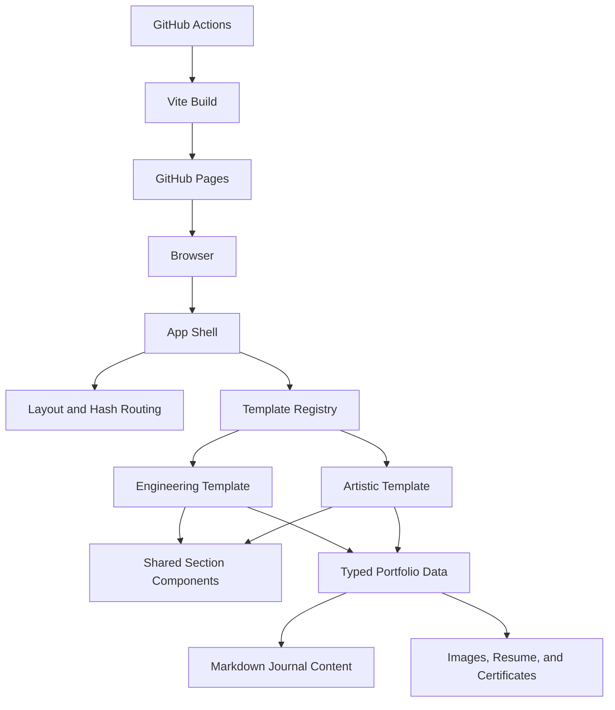
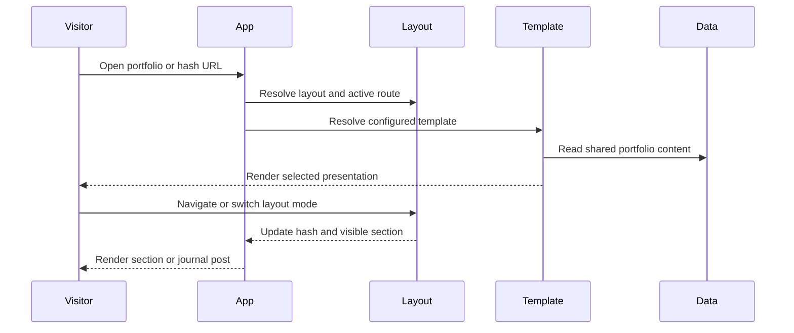

# System Architecture

## System Overview

This project is a static React 19 and TypeScript portfolio built with Vite. `App` combines a template registry, typed portfolio data, hash-based layout routing, local journal routing, and shared navigation. The engineering and artistic templates consume the same data model and can substitute section components without duplicating student content. Chakra UI supplies responsive primitives, custom CSS variables define template themes, and GitHub Actions deploys the Vite build to GitHub Pages.

## Architecture Diagram

### Text Alternative

The browser loads the App shell. App resolves navigation and hash routing, selects a registered template, and renders that template's section mapping. Both templates consume shared typed data, Markdown journal content, and bundled assets. GitHub Actions runs Vite and deploys the output to GitHub Pages.

## Component Descriptions

### Application Package
- **Purpose**: Static student portfolio frontend.
- **Responsibilities**: Resolve journal routes, layout mode, navigation state, template selection, and visible section rendering.
- **Dependencies**: React, Chakra UI, template registry, layout hook, typed data, and browser history APIs.
- **Type**: Application.

### Template Registry
- **Purpose**: Provide swappable presentation strategies.
- **Responsibilities**: Register engineering and artistic templates, resolve `selectedTemplateId`, fall back to engineering, and expose complete section mappings.
- **Dependencies**: Template definitions and shared `SectionId` contract.
- **Type**: Application model.

### Engineering Template
- **Purpose**: Present technical and career evidence in a structured format.
- **Responsibilities**: Map all sections to the baseline shared components.
- **Dependencies**: Shared section components and portfolio data.
- **Type**: Presentation.

### Artistic Template
- **Purpose**: Present the same evidence with stronger visual and editorial emphasis.
- **Responsibilities**: Supply artistic Hero, Projects, Gallery, and section shell components while currently reusing the remaining shared sections and shared navigation.
- **Dependencies**: Shared data, shared components, gallery media, and artistic CSS variables.
- **Type**: Presentation.

### Layout and Journal Routing
- **Purpose**: Support continuous, section-routed, and local-post experiences without a server router.
- **Responsibilities**: Persist layout mode, parse hashes, render one or all sections, and resolve `#/journal/{slug}` routes.
- **Dependencies**: Browser history, local storage, navigation configuration, and journal utilities.
- **Type**: Application behavior.

### UI Provider and Shared UI
- **Purpose**: Provide theming and reusable presentation primitives.
- **Responsibilities**: Configure Chakra, color mode, actions, section shells, logo marks, tooltips, and toasts.
- **Dependencies**: Chakra UI, Emotion, next-themes, and React Icons.
- **Type**: Shared UI support.

### GitHub Pages Workflow
- **Purpose**: Build and publish the static portfolio.
- **Responsibilities**: Install Node dependencies, derive the repository base path, run the build, and deploy `dist/`.
- **Dependencies**: GitHub Actions and Vite.
- **Type**: Deployment automation.

## Data Flow

### Text Alternative

A visitor opens the site, App resolves the URL and chosen template, and the template reads shared portfolio data. Navigation updates the URL and visible content. Local journal hashes render a dedicated post page; other section hashes render one or all template sections depending on layout mode.

## Integration Points

- **External APIs**: None.
- **Databases**: None.
- **Third-party Services**: GitHub and GitHub Pages, LinkedIn, WordPress, YouTube embeds, Google Fonts, and the visitor's email client through `mailto:`.
- **Browser APIs**: History, hash changes, local storage, scrolling, and media/dialog interactions.

## Infrastructure Components

- **CDK Stacks**: None.
- **Deployment Model**: GitHub Actions builds a static Vite artifact and deploys it to GitHub Pages.
- **Networking**: Public static hosting with no API server, private network, or database.
