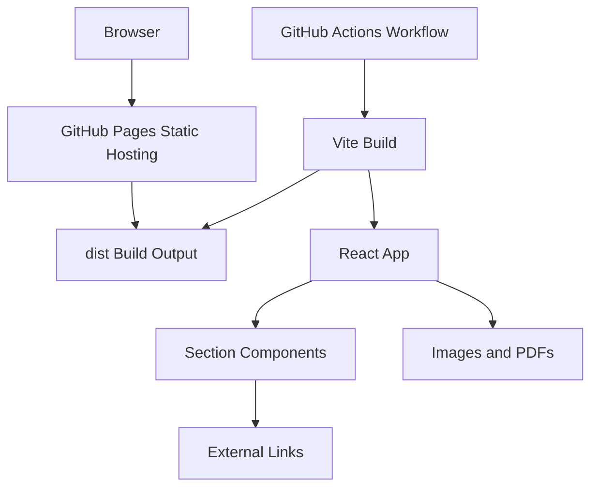
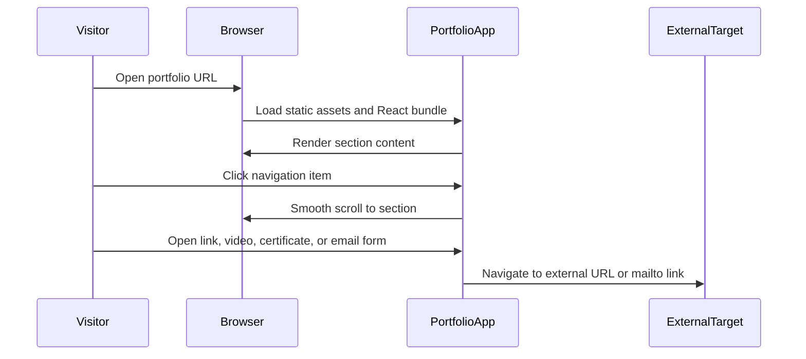

# System Architecture

## System Overview

This project is a static single-page React application built with Vite. It renders a portfolio as a sequence of section components and uses Chakra UI for layout primitives, Tailwind CSS for the imported utility layer, custom CSS variables for the visual theme, and Vite asset imports for local images and PDF certificates. The production artifact is a `dist/` folder that can be served by GitHub Pages.

## Architecture Diagram

### Text Alternative

GitHub Actions runs the Vite build. Vite bundles the React app and static assets into `dist/`. GitHub Pages serves `dist/` to browser visitors. The app renders local content and links out to GitHub, LinkedIn, YouTube, WordPress, and email.

## Component Descriptions

### Application Package
- **Purpose**: Static portfolio frontend.
- **Responsibilities**: Render content sections, manage active navigation, provide responsive layout and interactions.
- **Dependencies**: React, React DOM, Chakra UI, Tailwind CSS Vite plugin, React Icons, Vite.
- **Type**: Application.

### UI Provider
- **Purpose**: Configure Chakra UI and color mode behavior.
- **Responsibilities**: Wrap the app with Chakra provider and theme/color-mode support.
- **Dependencies**: Chakra UI, next-themes.
- **Type**: Shared UI support.

### GitHub Pages Workflow
- **Purpose**: Deploy the static app from `main`.
- **Responsibilities**: Checkout, setup Node 20, run `npm ci`, run `npm run build`, upload pages artifact, deploy pages.
- **Dependencies**: GitHub Actions pages actions.
- **Type**: Deployment automation.

## Data Flow

### Text Alternative

The browser loads the built app, React renders portfolio content, visitor actions trigger section scrolling or external navigation, and the contact form creates a mailto URL.

## Integration Points

- **External APIs**: None.
- **Databases**: None.
- **Third-party Services**:
  - GitHub repositories and GitHub Pages for source hosting and deployment.
  - LinkedIn and WordPress for external profile/content links.
  - YouTube embed URLs for educational videos.
  - Mailto link for contact submission.
  - Google Fonts import in `src/index.css`.

## Infrastructure Components

- **CDK Stacks**: None.
- **Deployment Model**: GitHub Actions builds a static Vite app and deploys it to GitHub Pages.
- **Networking**: Public static website. No server runtime, database, private network, or API gateway.

## Template Readiness Observations

- Current section content is embedded inside React components, which makes customization harder for beginner students.
- Navigation items are duplicated between `App.tsx` and `Navbar.tsx`.
- Scroll helper logic is repeated in most sections.
- The deployment base path is fixed to `/my-portfolio/`, which students must change for their own repository name.
- The existing deployment workflow is suitable for GitHub Pages and can remain the publishing foundation.
