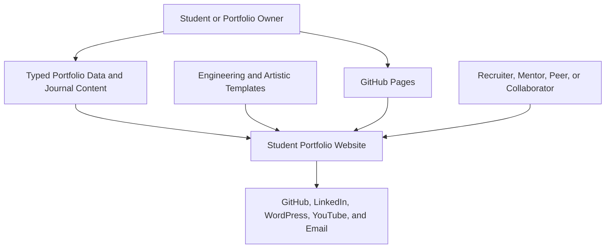

# Business Overview

## Business Context Diagram

### Text Alternative

Students maintain shared typed content, select a presentation template, and publish the static site to GitHub Pages. Visitors browse the chosen presentation, open local journal posts, inspect portfolio evidence, and follow external links.

## Business Description

- **Business Description**: The application is a reusable student portfolio that separates personal content from presentation. The same profile, education, experience, projects, media, writing, skills, and contact data can be rendered through engineering or artistic templates.
- **Primary Template Goal**: Give students with different disciplines a credible starting point they can customize without duplicating content or needing a backend.
- **Business Transactions**:
  - A student edits typed files in `src/data/`, Markdown journal content, and local media assets.
  - A student chooses the engineering or artistic presentation in `src/data/template.ts`.
  - A visitor browses all enabled sections in single-page mode or one section at a time in multi-page mode.
  - A visitor navigates through desktop or mobile controls and can switch color and layout modes.
  - A visitor opens an in-site journal post through a GitHub Pages-safe hash route.
  - A visitor follows external posts, social profiles, repositories, videos, and email actions.
  - A visitor downloads the portfolio owner's resume.
  - GitHub Actions builds and deploys the static application to GitHub Pages.

## Business Dictionary

- **Portfolio Owner**: The student or professional whose work and identity are presented.
- **Portfolio Visitor**: A recruiter, reviewer, mentor, peer, collaborator, or prospective client.
- **Portfolio Template**: A registered presentation strategy that maps every shared section ID to a React component.
- **Engineering Template**: The structured technical presentation using the baseline section components.
- **Artistic Template**: The visual presentation intended for art, design, media, creative process, and interdisciplinary work.
- **Layout Mode**: Either a continuous single-page experience or hash-routed multi-page section view.
- **Writing Entry**: A local in-site journal post or an external WordPress post shown in the Journal section.
- **Section**: A typed portfolio area such as Home, About, Projects, Gallery, Journal, or Contact.

## Component-Level Business Descriptions

### Application Shell
- **Purpose**: Resolve template, layout, navigation, and journal routes into the visible experience.
- **Responsibilities**: Render the active navigation and section components while preserving GitHub Pages compatibility.

### Template Registry
- **Purpose**: Let one portfolio dataset support multiple student-facing outlooks.
- **Responsibilities**: Register templates, resolve the configured template, and guarantee a component for every section.

### Content and Writing Data
- **Purpose**: Keep student-editable information separate from JSX presentation.
- **Responsibilities**: Export typed profile, career, project, media, journal, skill, certificate, and navigation records.

### Navigation and Layout
- **Purpose**: Let visitors move through the portfolio efficiently on desktop and mobile.
- **Responsibilities**: Handle active state, single/multi-page modes, hash links, theme switching, and mobile navigation.

### Deployment Workflow
- **Purpose**: Publish student portfolios without application servers.
- **Responsibilities**: Derive the GitHub Pages base path, build `dist/`, and deploy the static artifact.
