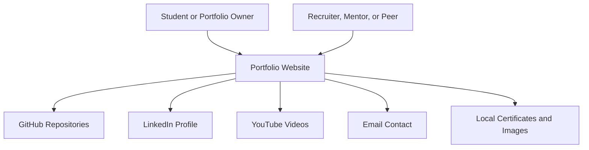

# Business Overview

## Business Context Diagram

### Text Alternative

The student edits and publishes the portfolio. Visitors browse sections, view assets, open external profiles and videos, and contact the owner by email.

## Business Description

- **Business Description**: The project is a personal portfolio website that presents a student's identity, education, work experience, awards, projects, media, skills, certificates, and contact channels in a single-page experience.
- **Primary Template Goal**: The project should become a baseline portfolio template that other students can fork, customize, deploy to GitHub Pages, and extend without deep React expertise.
- **Business Transactions**:
  - Visitor reviews profile summary and calls to action in the hero section.
  - Visitor navigates between portfolio sections using fixed desktop and mobile navigation.
  - Visitor reviews education, experience, awards, and project cards.
  - Visitor opens gallery images, embedded videos, certificates, external repositories, and profile links.
  - Visitor submits a mailto-based contact form that opens the user's email client.
  - Student customizes portfolio content and deploys the site through GitHub Pages.

## Business Dictionary

- **Portfolio Owner**: The student or professional whose information appears on the site.
- **Portfolio Visitor**: Recruiter, interviewer, mentor, peer, scholarship reviewer, or collaborator viewing the site.
- **Section**: A full-screen content area such as Hero, About, Education, Experience, Projects, Skills, or Contact.
- **Baseline Template**: A reusable starting point that students can adapt by changing structured content, assets, links, and deployment settings.
- **GitHub Pages Deployment**: Static hosting workflow that builds the Vite site and publishes `dist/` using GitHub Actions.

## Component Level Business Descriptions

### App Shell
- **Purpose**: Orders all visible portfolio sections and tracks the current section while scrolling.
- **Responsibilities**: Render navigation and section components, maintain active navigation state, and provide a single-page portfolio flow.

### Navigation
- **Purpose**: Help visitors move between sections quickly.
- **Responsibilities**: Render desktop navigation, mobile drawer navigation, profile shortcut, active section highlight, and smooth scrolling.

### Content Sections
- **Purpose**: Present student profile information in themed, responsive sections.
- **Responsibilities**: Render profile summary, education, experience, awards, projects, gallery, videos, skills, certificates, and contact form.

### Static Asset Collection
- **Purpose**: Provide visual identity and supporting proof such as photos, logos, and certificates.
- **Responsibilities**: Bundle local media files through Vite for optimized static delivery.

### Deployment Workflow
- **Purpose**: Publish the static portfolio to GitHub Pages.
- **Responsibilities**: Install dependencies, build the site, upload the `dist/` artifact, and deploy it from GitHub Actions.
