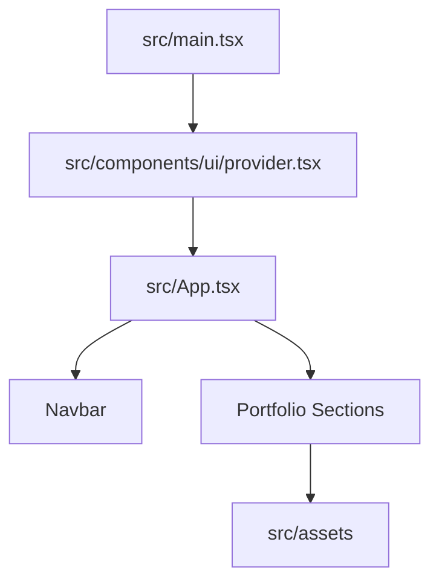

# Code Structure

## Build System

- **Type**: npm scripts with Vite and TypeScript project references.
- **Configuration**:
  - `package.json` defines `dev`, `build`, `lint`, and `preview`.
  - `vite.config.ts` configures React SWC, Tailwind CSS, TypeScript paths, and `base: '/my-portfolio/'`.
  - `tsconfig.app.json` uses strict TypeScript checks for app code.
  - `eslint.config.ts` configures ESLint recommended, TypeScript recommended, React recommended, and Prettier compatibility.
  - `.github/workflows/deploy.yml` deploys `dist/` to GitHub Pages.

## Module Hierarchy

### Text Alternative

`main.tsx` mounts the Chakra provider and `App`. `App` renders `Navbar` and each portfolio section. Section components import local assets directly.

## Existing Files Inventory

- `src/main.tsx` - React entrypoint that mounts `App` inside Chakra provider and React strict mode.
- `src/App.tsx` - Application shell, section ordering, active section tracking.
- `src/App.css` - Shared animation and engineering-grid styles.
- `src/index.css` - Global CSS imports, CSS variables, base document styles, font class.
- `src/components/Navbar.tsx` - Fixed navigation bar, mobile drawer, smooth scroll navigation.
- `src/components/Hero.tsx` - Hero section, profile image, headline, CTA buttons, social links.
- `src/components/About.tsx` - About text and summary metrics.
- `src/components/Education.tsx` - Education timeline/cards with institution logos.
- `src/components/Experience.tsx` - Professional experience timeline.
- `src/components/Awards.tsx` - Awards and achievements cards.
- `src/components/Projects.tsx` - Project cards with external repository/demo links.
- `src/components/Gallery.tsx` - Image gallery with modal preview.
- `src/components/Videos.tsx` - YouTube video embeds and external watch links.
- `src/components/Skills.tsx` - Skills, certificate metadata, certificate previews, modal PDF viewer.
- `src/components/Contact.tsx` - Contact form that generates a mailto URL and social links.
- `src/components/ui/provider.tsx` - Chakra UI provider wrapper.
- `src/components/ui/color-mode.tsx` - Chakra color mode helpers.
- `src/components/ui/tooltip.tsx` - Chakra tooltip helper.
- `src/components/ui/toaster.tsx` - Chakra toaster helper.
- `src/assets/*` - Local images, logos, and PDF certificate assets.
- `.github/workflows/deploy.yml` - GitHub Pages deployment automation.
- `README.md` - Current project setup and overview.
- `DEPLOYMENT.md` - Current GitHub Pages deployment guide.

## Design Patterns

### Section Component Pattern
- **Location**: `src/components/*.tsx`.
- **Purpose**: Keep each portfolio area isolated as a React function component.
- **Implementation**: Each section renders a root `Box` with a stable `id`, shared classes, Chakra layout primitives, and local arrays for repeatable content.

### Data-Driven Card Rendering
- **Location**: `Experience.tsx`, `Education.tsx`, `Awards.tsx`, `Projects.tsx`, `Gallery.tsx`, `Videos.tsx`, `Skills.tsx`.
- **Purpose**: Render repeated cards from arrays.
- **Implementation**: Arrays are declared inside or near components and mapped into Chakra UI cards.

### Static Asset Imports
- **Location**: Section components and `Skills.tsx`.
- **Purpose**: Let Vite resolve hashed production asset URLs.
- **Implementation**: Direct imports for images; `import.meta.glob` for certificate PDFs.

### Mailto Contact Pattern
- **Location**: `Contact.tsx`.
- **Purpose**: Avoid backend infrastructure while still offering a contact form.
- **Implementation**: Form state is encoded into a `mailto:` URL on submit.

## Critical Dependencies

### React
- **Version**: 19.2.0.
- **Usage**: Component rendering and state/effect hooks.
- **Purpose**: Main UI framework.

### Vite
- **Version**: 7.2.4.
- **Usage**: Development server, bundling, asset handling, production build.
- **Purpose**: Static frontend build system.

### Chakra UI
- **Version**: 3.30.0.
- **Usage**: Layout, responsive props, buttons, drawer, dialog, form controls, badges.
- **Purpose**: Component primitives and styling system.

### Tailwind CSS
- **Version**: 4.1.18.
- **Usage**: Imported in global CSS and configured through Vite plugin.
- **Purpose**: Utility CSS support, though most visible styling currently uses Chakra props and custom CSS variables.

### React Icons
- **Version**: 5.5.0.
- **Usage**: Social, navigation, arrow, and external-link icons.
- **Purpose**: Icon rendering.

## Maintainability Risks

- Student-editable data is mixed with JSX, increasing the chance of breaking layout while changing content.
- Repeated scroll helpers and section IDs can drift out of sync.
- The fixed `base` path requires manual edits for every fork unless made configurable.
- README includes Vite starter text that can distract template users.
- There are no tests for rendering, navigation links, or deployment configuration.
