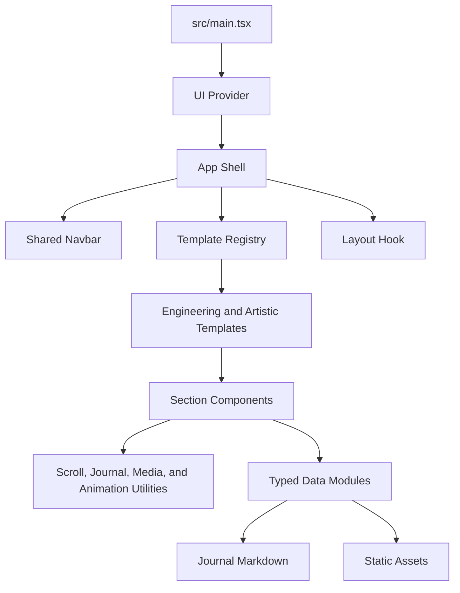

# Code Structure

## Build System

- **Type**: npm scripts with Vite and TypeScript project references.
- **Configuration**:
  - `package.json` defines `dev`, `test`, `build`, `lint`, and `preview`.
  - `vite.config.ts` configures React SWC, Tailwind CSS, TypeScript paths, Vitest, and an environment-driven base path.
  - `tsconfig.app.json` enables strict TypeScript checks for application and test code.
  - `eslint.config.ts` configures base JavaScript, TypeScript, React, and Prettier compatibility.
  - `.github/workflows/deploy.yml` derives the GitHub Pages base path and deploys `dist/`.

## Module Hierarchy

### Text Alternative

`main.tsx` mounts the provider and App. App uses the shared Navbar, layout hook, and template registry. Templates map section IDs to section components. Components consume typed data and utilities; data modules import journal Markdown and static assets.

## Existing Files Inventory

### Application and Styling
- `src/main.tsx` - React entrypoint and provider mount.
- `src/App.tsx` - Template, navigation, layout, and journal route orchestration.
- `src/App.css` - Template-scoped variables, backgrounds, and shared animations.
- `src/index.css` - Global variables, document styles, font import, and color mode values.

### Templates
- `src/data/template.ts` - Student-editable active template selection.
- `src/templates/types.ts` - Template ID and complete section-map contract.
- `src/templates/index.ts` - Registry, active template resolution, and fallback.
- `src/templates/engineering/index.ts` - Engineering section mapping.
- `src/templates/artistic/index.ts` - Artistic section mapping.
- `src/templates/artistic/ArtisticHero.tsx` - Artistic first viewport.
- `src/templates/artistic/ArtisticProjects.tsx` - Editorial project studies.
- `src/templates/artistic/ArtisticGallery.tsx` - Artistic image collection and modal.
- `src/templates/artistic/ArtisticSectionShell.tsx` - Artistic section framing.

### Shared and Baseline Components
- `src/components/Navbar.tsx` - Shared fixed desktop/mobile navigation, layout switch, and color mode control.
- `src/components/Hero.tsx` - Engineering hero.
- `src/components/About.tsx` - Biography and metrics.
- `src/components/Education.tsx` - Education records.
- `src/components/Experience.tsx` - Experience timeline.
- `src/components/Awards.tsx` - Awards and recognitions.
- `src/components/Projects.tsx` - Engineering project cards.
- `src/components/Gallery.tsx` - Engineering media gallery and preview.
- `src/components/Journal.tsx` - Combined local and external writing cards.
- `src/components/JournalPostPage.tsx` - Local post detail and not-found states.
- `src/components/Skills.tsx` - Skills and certificate previews.
- `src/components/Contact.tsx` - Contact form and social actions.
- `src/components/shared/*` - Shared section, card, action, and logo primitives.
- `src/components/ui/*` - Chakra provider, color mode, tooltip, and toaster helpers.

### Data, Content, Types, and Utilities
- `src/data/*.ts` - Typed student-editable profile, navigation, career, project, media, writing, skill, certificate, and template configuration.
- `src/content/journal/*.md` - Local journal article bodies.
- `src/types/portfolio.ts` - Shared content and section contracts.
- `src/hooks/usePortfolioLayout.ts` - Layout persistence, hash parsing, and section navigation.
- `src/utils/scroll.ts` - Enabled-navigation filtering, active-section tracking, and smooth scrolling.
- `src/utils/journal.ts` - Local journal route creation and parsing.
- `src/utils/media.ts` - YouTube URL helpers.
- `src/utils/animation.ts` - Staggered reveal class selection.

### Tests and Delivery
- `src/App.test.tsx` - App rendering, layout mode, navigation, and journal route smoke tests.
- `src/data/navigation.test.ts` - Section/navigation configuration tests.
- `src/data/portfolio.test.ts` - Portfolio content and link validation tests.
- `src/hooks/usePortfolioLayout.test.ts` - Layout helper tests.
- `src/templates/templateRegistry.test.ts` - Template resolution and section completeness tests.
- `.github/workflows/deploy.yml` - GitHub Pages deployment workflow.
- `README.md` - Student customization and publishing manual.
- `DEPLOYMENT.md` - Detailed deployment guidance.

## Design Patterns

### Registry and Strategy Pattern
- **Location**: `src/templates/`.
- **Purpose**: Swap presentation while preserving one content model.
- **Implementation**: Each `PortfolioTemplate` supplies a `Record<SectionId, ComponentType>` and the registry resolves the configured ID.

### Typed Content Configuration
- **Location**: `src/data/` and `src/types/portfolio.ts`.
- **Purpose**: Let students edit content without modifying presentation logic.
- **Implementation**: Section data uses `satisfies` against shared TypeScript types and is aggregated by `portfolio.ts`.

### Hash-Routed Static Navigation
- **Location**: `src/hooks/usePortfolioLayout.ts`, `src/utils/journal.ts`, and `src/App.tsx`.
- **Purpose**: Support direct links and multiple layout modes on GitHub Pages without a server router.
- **Implementation**: Anchor hashes represent single-page sections; `#/section` and `#/journal/slug` represent routed views.

### Shared Section and Action Primitives
- **Location**: `src/components/shared/`.
- **Purpose**: Keep recurring layout, links, logos, and accessibility behavior consistent.
- **Implementation**: Shared React components receive typed props and CSS-variable styling.

## Critical Dependencies

- **React 19.2.0** - Component rendering, state, effects, and hooks.
- **Chakra UI 3.30.0** - Responsive primitives, controls, drawers, dialogs, and styling props.
- **Vite 7.2.4** - Development server, asset handling, testing integration, and production bundling.
- **Vitest 4.1.9 and Testing Library 16.3.2** - Unit and DOM behavior tests.
- **React Icons 5.5.0** - Navigation, action, social, and status iconography.

## Maintainability Risks

- The template contract only varies section components; the shared Navbar and App-level layout behavior cannot yet differ by template.
- The artistic template still reuses most engineering section components, limiting visual and interaction differentiation.
- `SectionId` and `sectionIds` are maintained separately and require tests to prevent drift.
- There are two ESLint configuration files, which can confuse contributors about the active configuration.
- Animation classes are CSS-driven and do not yet centralize reduced-motion behavior for template-specific interactions.
