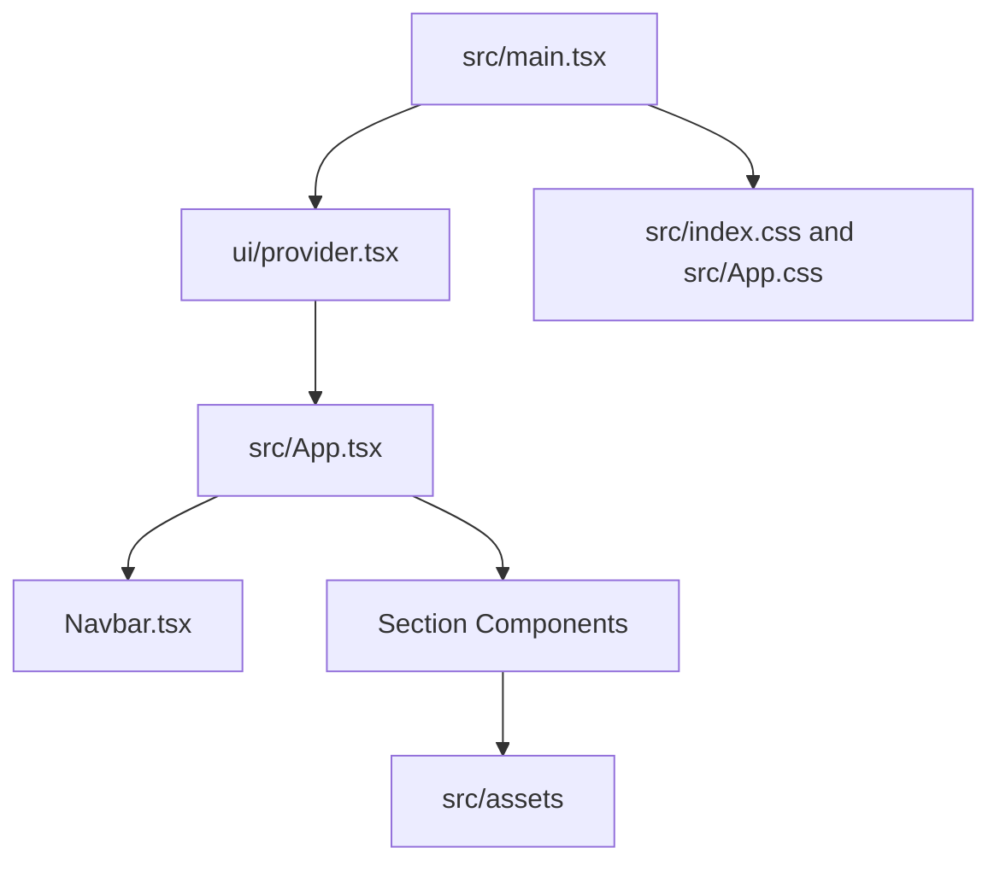

# Dependencies

## Internal Dependencies

### Text Alternative

`main.tsx` depends on provider, app, and global styles. `App.tsx` depends on navigation and all section components. Section components depend on local images and PDFs.

### `src/main.tsx` depends on `src/App.tsx`
- **Type**: Runtime.
- **Reason**: Mounts the application.

### `src/main.tsx` depends on `src/components/ui/provider.tsx`
- **Type**: Runtime.
- **Reason**: Provides Chakra UI context.

### `src/App.tsx` depends on section components
- **Type**: Runtime.
- **Reason**: Renders the full page sequence.

### Section components depend on static assets
- **Type**: Runtime/build.
- **Reason**: Images and certificates are resolved by Vite into production asset URLs.

## External Dependencies

### `@chakra-ui/react`
- **Version**: ^3.30.0.
- **Purpose**: UI primitives, responsive props, dialogs, drawer, form controls.
- **License**: MIT.

### `@chakra-ui/icons`
- **Version**: ^2.2.4.
- **Purpose**: Chakra icon support package. No direct usage was identified in the inspected source.
- **License**: MIT.

### `@emotion/react`
- **Version**: ^11.14.0.
- **Purpose**: Styling dependency for Chakra UI.
- **License**: MIT.

### `@tailwindcss/vite`
- **Version**: ^4.1.18.
- **Purpose**: Tailwind integration with Vite.
- **License**: MIT.

### `next-themes`
- **Version**: ^0.4.6.
- **Purpose**: Color mode/theme behavior through Chakra UI helpers.
- **License**: MIT.

### `react`
- **Version**: ^19.2.0.
- **Purpose**: UI framework.
- **License**: MIT.

### `react-dom`
- **Version**: ^19.2.0.
- **Purpose**: DOM rendering.
- **License**: MIT.

### `react-icons`
- **Version**: ^5.5.0.
- **Purpose**: Icons in navigation, CTAs, section arrows, and links.
- **License**: MIT.

### `tailwindcss`
- **Version**: ^4.1.18.
- **Purpose**: Utility CSS framework.
- **License**: MIT.

## Dependency Health Notes

- The project has both `eslint.config.js` and `eslint.config.ts` files. This can confuse new contributors if the active config is unclear.
- Several installed lint plugins are not fully represented in `eslint.config.ts`.
- For template usage, dependency versions are modern but may create friction if students use older Node versions. The guide should state Node 20 or newer clearly.
