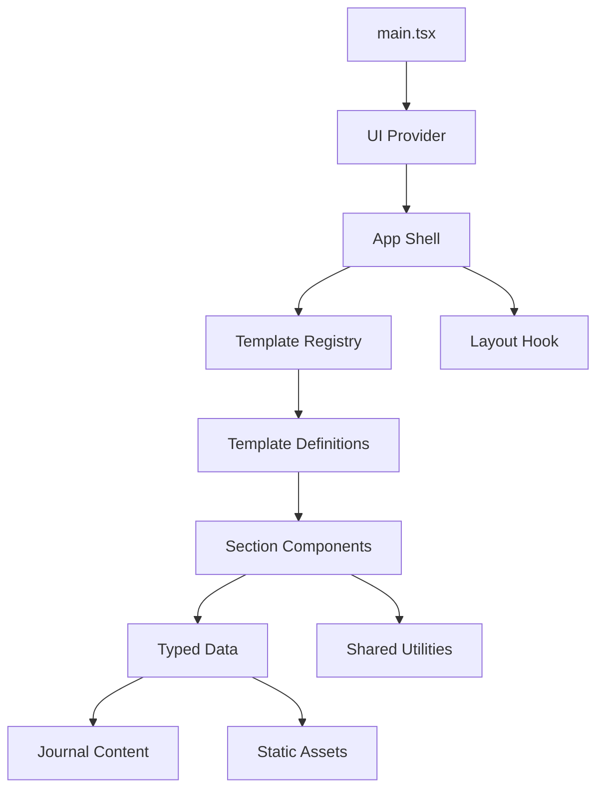

# Dependencies

## Internal Dependencies

### Text Alternative

The entrypoint mounts the UI provider and App. App resolves the registry and layout hook. The registry loads template definitions; templates select section components. Components consume typed data and utilities, while data modules import local content and assets.

### Key Internal Relationships

- `src/App.tsx` depends on navigation data, layout behavior, journal parsing, the shared Navbar, and active template.
- `src/templates/index.ts` depends on the configured template ID and both template definitions.
- Every template depends on the complete `SectionId` contract.
- Artistic components depend on shared portfolio data, shared actions/logo helpers, and artistic section framing.
- Shared and engineering components depend on the same typed data modules and shared utilities.
- Journal data depends on Markdown content and journal hash helpers.
- Tests depend on the registry, data contracts, App behavior, and jsdom provider setup.

## External Dependencies

- **`@chakra-ui/react` ^3.30.0** - UI primitives, responsive styling, drawers, dialogs, and controls; MIT.
- **`@chakra-ui/icons` ^2.2.4** - Chakra icon package; MIT; no direct source usage identified.
- **`@emotion/react` ^11.14.0** - Chakra styling runtime; MIT.
- **`@tailwindcss/vite` ^4.1.18 and `tailwindcss` ^4.1.18** - Utility CSS integration; MIT.
- **`next-themes` ^0.4.6** - Theme state; MIT.
- **`react` and `react-dom` ^19.2.0** - UI framework and DOM renderer; MIT.
- **`react-icons` ^5.5.0** - Icon components; MIT.
- **`vite` ^7.2.4 and `@vitejs/plugin-react-swc` ^4.2.2** - Development and build pipeline; MIT.
- **`vitest` ^4.1.9, Testing Library, and jsdom** - Automated tests; MIT.
- **ESLint, TypeScript ESLint, and Prettier** - Static quality and formatting tools; MIT.

## Dependency Health Notes

- The stack is current and compatible with the documented Node 20 workflow.
- The project has both `eslint.config.js` and `eslint.config.ts`; the active configuration should be clarified or consolidated later.
- Animation work can be implemented with CSS and React already present; a new animation library should only be added if the approved interaction design requires capabilities that CSS cannot provide cleanly.
- There is no router package. The current hash-routing utilities deliberately avoid server rewrite requirements on GitHub Pages.
